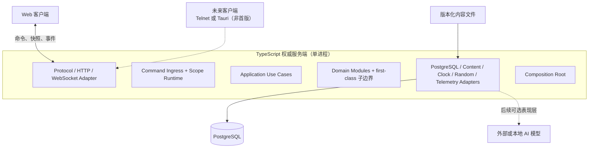
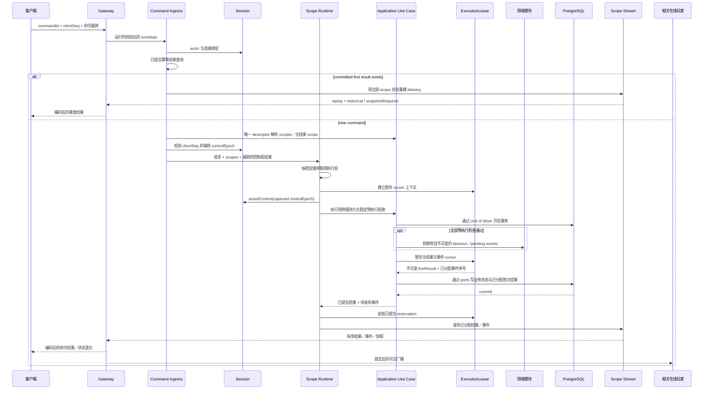

# MUD-WoW 服务端架构

状态：已确认总体方向与模块边界，具体库待选 
日期：2026-07-19 
适用范围：北郡 1–5 级垂直切片，并为后续 1–22 级内容保留清晰扩展路径

## 1. 背景与决策

本项目是一个以 Vanilla 人类联盟路线为蓝本的多人文字 MUD。北郡 v1 的玩家会共享房间与战斗；正式队伍、交易等系统留给后续阶段。所有会改变游戏结果的操作都必须由同一个权威服务端裁决。

“多人”不等于“必须微服务”。北郡 v1 采用 **Node.js + TypeScript 模块化单体**：一个应用进程可以同时维护多个玩家连接，并在同一进程内协调房间、任务、战斗和社交交互。与过早拆分服务相比，这能减少跨服务事务、状态同步和部署复杂度，更适合当前规模和 MVP 目标。

已确定的技术方向：

| 项目 | 决策 |
|---|---|
| 服务端语言 | TypeScript |
| 运行形态 | 单进程、模块化单体、权威服务端 |
| 客户端通信 | HTTP + WebSocket；具体库待定 |
| 持久化 | PostgreSQL |
| 内容 | 仓库内结构化数据，启动时完整校验 |
| AI | 北郡 v1 关闭；后续仅可作为不参与规则裁决的可选表现层 |
| 首版客户端 | Web 客户端；具体框架待定 |
| 首版不采用 | Rust、Tauri、Redis、微服务、事件总线 |

本文件只规定规则如何进入权威服务端、串行队列、内存状态和持久化边界。北郡 v1 的全部玩法语义与运行时约束以[北郡 v1 可执行设计包](northshire-v1/README.md)为准；[通用战斗系统设计](combat-system.md)只负责 v1 以外的方向，不能向 v1 隐式补充规则。

具体库尚未锁定。Fastify、WebSocket 插件、Zod、Vitest 等是当前候选，不是架构的硬依赖。选库应由北郡垂直切片中的实际开发体验和测试结果决定。

本架构继承[调研与 MVP 蓝图](research/vanilla-wow-text-mud-research.md)中的核心约束：

- 北郡首个垂直切片验证移动、任务、战斗、掉落、升级、训练和存档；
- 战斗保留自动攻击、读条、打断、资源和仇恨，但删除无助于文字玩法的细枝末节；
- 任务是带前置、步骤、事件和知识揭示的图；
- 世界事实与游戏结果由结构化规则决定，AI 只负责措辞；
- 第一版不引入微服务、通用脚本语言或可热插拔规则引擎。

## 2. 架构目标

### 2.1 必须满足

1. 多个玩家可以同时连接并看到一致的房间与战斗结果；后续队伍系统也必须沿用相同权威边界。
2. 客户端只能提交意图，不能自行决定移动、伤害、掉落、冷却或任务进度。
3. 同一场交互中的命令按明确顺序执行，避免重复拾取、重复奖励和竞态覆盖。
4. 角色位置、背包、任务、生命等持久状态在退出重连后准确恢复。
5. 游戏规则可用纯逻辑和可控时钟、随机数进行确定性测试。
6. 新增区域、任务、敌人和技能以新增或修改数据为主，而不是复制业务代码。
7. 首版部署和本地开发保持简单：一个应用进程加一个 PostgreSQL 实例。

### 2.2 设计原则

- **服务端权威：**任何改变状态的决定只发生在服务端。
- **模块内高内聚：**状态、规则和用例归属明确，禁止绕过模块接口直接改表。
- **提交后广播：**先完成规则校验和数据库提交，再向玩家发送结果。
- **显式时间：**战斗规则不直接依赖系统时间，统一使用可注入的时钟。
- **数据驱动：**静态世界和内容使用带版本的结构化数据。
- **先证实再扩展：**先完成北郡闭环，只有测量到真实问题后才增加基础设施。

## 3. 总体组件

下图只表达部署归属和外部连接，不表达 TypeScript import 或一次命令的调用顺序；运行时调用图与源码依赖图分别见[开发计划 §4.1](development-plan.md#41-运行时调用与提交顺序)和[§4.2](development-plan.md#42-源码-import-与端口实现方向)。

应用进程是唯一权威运行单元。WebSocket 连接、房间在线成员、战斗调度队列等短暂状态保存在内存；角色进度和不可重复的结果保存在 PostgreSQL。客户端断线不会转移权威。

## 4. 模块边界

首版固定“领域模块、first-class 领域子边界、应用／运行时组件、基础设施适配器”四类边界。它们都是同一个服务端 package 与部署单元内的代码边界，不是独立服务；Persistence 不再与领域模块并列称为“主要模块”。

| 领域模块 | 拥有的职责 | 不负责 |
|---|---|---|
| Session | 登录会话、角色选择、连接与断线、重连、命令序号、会话到角色映射 | 房间规则、伤害计算 |
| World | 房间与出口、位置、在线存在、移动、NPC/敌人实例、权威 `CharacterState`、物品与背包用例 | 任务条件、战斗时间线 |
| Quest | 任务图、接取与交付、目标事件、知识标记、奖励条件 | 自行写入背包或生成掉落 |
| Combat | CombatSession、自动攻击、持久战术、覆盖动作、接战关系、技能、冷却、读条、效果、战斗中资源投影、仇恨、摘要、死亡与遭遇阶段 | 网络连接、生成式 AI 措辞、另存一份角色权威余额 |
| Social | 北郡 v1 可选的 `say`；密语、队伍、交易、公会、邮件按后续版本逐步加入 | 在线连接绑定、房间成员真相、角色战斗结果 |

World 内部把 Character、Presence & Spawn、Inventory & Progression、Rewards 设为 first-class 子边界；Combat 内部把 Scheduler、Tactics、Lifecycle 设为封闭子边界。它们拥有独立 `public.ts` 和导入限制，但首版仍保留在所属目录，不拆 npm package 或部署单元。应用／运行时组件包括 Command Ingress、Idempotency Store、Scope Executor、Scope Stream 和无状态 Application Use Case；Persistence、Content Catalog、Clock、Random、Telemetry、HTTP／WebSocket 都是适配器。

`CharacterState` 是角色永久状态的唯一逻辑权威，Character 是永久字段的唯一最终写入／合并入口；Quest、Inventory & Progression、Combat、Rewards 分别拥有语义规则，只返回窄且不可变的 decision。Combat 只持有当前 Attempt 的唯一运行时投影，Rewards ledger 只拥有敌人逐代奖励事实和 PersonalLoot，不是第二份角色余额。字段矩阵见[开发计划 §3.2](development-plan.md#32-主模块与内部拆分)，完整字段见[northshire-v1/01 §2](northshire-v1/01-player-flow.md)，live／durable／projection 合并语义见[multiplayer-consistency.md §9](multiplayer-consistency.md)。若后续职责显著膨胀，再依据真实依赖拆分代码模块。

### 4.1 依赖规则

1. Gateway 只能调用 Runtime 公共入口；Command Ingress 可调用 Session 公共控制门面完成 actor／连接／序号校验，Scope Runtime 再调用 Application Use Case。接入与运行时都不能直接访问数据库、领域内部对象或玩法状态。
2. 领域模块不能依赖 HTTP、WebSocket、PostgreSQL 驱动或 AI SDK。
3. 需要持久化的模块定义自己所需的仓储接口；Persistence 提供实现。
4. 除 Command Ingress 使用 Session 公共控制门面外，跨模块协作通过公开的 TypeScript 接口和明确的用例协调器完成，不互相访问内部对象或数据表。
5. 一次操作需要修改多个模块时，由应用用例开启同一个数据库事务并协调各模块。
6. 首版的模块通知使用进程内、带类型的函数调用或领域事件；不引入外部消息队列和通用事件总线。
7. 共享代码只包含稳定的小型原语，例如 ID、`ExecutionScopeKey`、Clock、RandomSource、事务上下文和错误类型；不能把业务逻辑堆入 shared 目录。
8. 禁止循环依赖。出现循环时，应把协调逻辑上移到应用层，而不是扩大公共模块。
9. Scope Runtime 是 scope 排序、执行权、读屏障、cursor reservation／安装和提交后发布的唯一所有者；Application 通过 public descriptor 声明 scopes，不得 import、定位或重入 Runtime，唯一可用能力是 Executor 传入、由 Application public 定义的窄 `ExecutionLease`。
10. 领域根与明确枚举的 World first-class 子边界只能通过各自 `public.ts` 被 Application import；Combat 内部组件保持 sealed。只有 `composition-root.ts` 可以同时导入基础设施与领域具体实现。允许矩阵和自动检查以[开发计划 §4.2](development-plan.md#42-源码-import-与端口实现方向)和[§5.1](development-plan.md#51-物理边界与自动检查)为准。

Web 与 Gateway 共享带显式版本并执行运行时校验的 protocol DTO；Gateway 再映射为 Application public 的传输无关请求／结果。Application 与 Domain 不 import 客户端或传输实现，共享类型也不能包含领域对象或让客户端导入服务端实现。`ExecutionScopeKey`、`UseCaseOutcome`、`PendingEvent`、`FirstResultRecord` 和 `ExecutionLease` 的所有者以[开发计划 §4.2](development-plan.md#42-源码-import-与端口实现方向)为准。

## 5. 运行时数据流

### 5.1 玩家命令

命令必须经协议校验→幂等→控制权→入队；精确 envelope／结果／事件、覆盖动作生命周期与扣费时机、scopeEpoch／scopeCursors 去重、同刻定序均以[多人一致性设计 §3–§5](multiplayer-consistency.md)为准。

Scope Runtime 独占 scope 排序、执行权、稳定读屏障、cursor reservation／安装、当前 delivery 计算和提交后发布。Application descriptor 唯一解析 scopes；Application 只能使用传入的 `ExecutionLease` 暂存 cursor，不能自行取得执行权、反向定位 Runtime 或直接广播。首次结果与业务状态在同一事务写入，commit 后才安装 reservation；回滚时 reservation 作废且不留下序号缺口。幂等 replay 不重新排队，但必须经 Scope Stream 根据当前 epoch／可见性重建 delivery。命令管线的完整不变量见[开发计划 §4.1](development-plan.md#41-运行时调用与提交顺序)。

每次成功接管角色控制权或显式撤权都会递增该角色的 `controlEpoch`。命令入队时记录当前值，真正执行前再次比对；这样旧连接已排队但尚未执行的命令不能在新连接接管后生效。`controlEpoch` 只解决控制权更替；北郡 v1 被动断线对已排队覆盖的处理见 [northshire-v1/04 §5.1](northshire-v1/04-combat-and-progression.md)，不能把该边界实现成一次连接接管。

Node.js 的单线程事件循环本身不能保证跨异步数据库调用的顺序。Scope Runtime 必须提供按作用域串行的轻量执行队列：

- 世界移动、房间交互和战斗命令按 WorldInstanceId 串行；一个 WorldInstance 可包含多个 CombatSession；
- 单角色操作按 characterId 串行；
- 涉及两个以上作用域的操作按稳定顺序获取执行权，并由数据库事务作最终保护。

首版不需要通用分布式锁。队列只负责单进程内排序，数据库约束、行锁或版本字段负责持久数据的一致性。

### 5.2 连接与重连

1. 客户端完成鉴权并选择角色。
2. Session 确认同一角色同一时刻只有一个主动控制连接；新连接成功接管时递增 `controlEpoch` 并使旧连接失权。
3. 服务端加载角色持久状态，并结合当前内存态生成完整快照；在相关 scope 的读屏障内先绑定新连接订阅并把快照放入其唯一 FIFO 发送队列，才释放屏障，使后续增量只会排在快照之后。
4. 客户端以服务端快照为准，不上传本地游戏状态。
5. 断线后短暂保留会话；重连时重新发送完整快照。MVP 不需要实现复杂的离线事件回放。

### 5.3 多玩家交互

玩家 A 和玩家 B 即使使用不同客户端，也连接到同一个权威进程。北郡 v1 的移动、共同战斗和个人掉落先在相应执行队列中裁决；提交后只把公开世界／战斗事件广播给可见玩家，PersonalLoot 明细仅发送给所属角色。正式组队、共享掉落和交易属于后续阶段，但必须复用同一权威与可见性边界。客户端显示延迟不会影响服务器中的先后顺序。

## 6. PostgreSQL 存储策略

### 6.1 持久状态

PostgreSQL 保存至少以下数据：

- 账号、角色及角色当前位置；
- 等级、经验、生命、资源、存活／死亡状态、死亡原因、已学习技能和训练状态；
- 服务端内置的全局 profile 模板解析结果、每角色个人战术与该角色固定 `afk_profile` 的已解析动作引用、不可变的 `CombatStartCheckpoint`、独立战斗 lifecycle 与最近未读战斗摘要；全局模板直接使用统一包级 `content_version`，只随内容包发布而变化，不另建独立版本真相。个人 `TacticsLoadout`／`tacticsRevision` 与该角色固定 afk 已解析动作引用同样持久化于此；语义与迁移规则见 [northshire-v1/05 §2](./northshire-v1/05-tactics-and-decisions.md)。开始检查点另保存规范化 activeTacticsRows[] 与 afkResolvedActionRefs[]，字段语义、行序规范化与不可回写约束见 [northshire-v1/06 §7.1](./northshire-v1/06-multiplayer-and-recovery.md)；
- 普通背包、独立任务物品栏、装备和金币；
- 任务实例（含每次进行期 ID）、步骤进度、完成历史、每个角色的知识标记和可空的 `sliceCompleteAt`；`slice_complete` 布尔值由该时间派生；
- 不可重复的奖励、掉落领取和经济操作；
- SpawnInstanceId、RewardEpoch、敌人已击败状态、终结原因、可信墙钟 `respawnEligibleAt` 和唯一奖励领取记录；
- `[later]` 物品绑定、耐久和自动使用消耗品的战术权限；
- `[later]` 需要跨重启保留的队伍、好友、公会、邮件等社交数据；
- 内容版本、数据库迁移版本和必要的审计记录。

内容实体使用稳定的字符串 ID，例如 zone、room、npc、mob、quest、item 和 ability ID；只有脚本化敌群或 Boss 需要额外发布 encounter ID。持久表引用这些 ID，避免数据库自增 ID 与仓库内容耦合。

### 6.2 内存状态

以下状态默认只存在于应用进程：

- WebSocket 连接和在线存在；
- 当前 CombatSession 的调度队列、仇恨表、读条、接战 transition、覆盖动作和短期效果；
- 房间订阅关系；
- 短期命令去重缓存；
- AI 文本请求的临时上下文。

MVP 中应用重启会终止未完成的战斗，而不会尝试逐 tick 恢复。每个 Attempt 开始时只创建一次不可变的 `CombatStartCheckpoint`；`active`、`reward_pending`、`closed`、关闭时间与原因记录在独立 lifecycle 中，奖励事务只能推进 lifecycle，不能重写起点。重启时按 lifecycle 和已经提交的击败状态／RewardEpoch 分类恢复；北郡 v1 的具体分类以[多人与恢复规格](northshire-v1/06-multiplayer-and-recovery.md)为准。已经终结的奖励代次不得因内存重置再次发奖，尚未提交的临时结果不得补造或复制。

`CharacterState` 的 live／durable 边界、安全离线卸载与战斗投影合并规则见 [multiplayer-consistency.md §9](multiplayer-consistency.md)。

### 6.3 事务与并发

- 任务交付由 Quest 决定合法性和任务奖励内容，Inventory & Progression 产生 typed grant，Character 合并任务、物品、XP 和金币字段；这些变化与首次幂等结果在同一个事务中完成，不写敌人 Rewards ledger。
- 拾取时同时更新掉落实例与背包，使用唯一约束防止重复领取。
- 敌人奖励由 Rewards 拥有逐 `RewardEpoch` 账本和 PersonalLoot lifecycle；角色 XP、金币、任务与背包余额仍只由 Character 合并。奖励事务的原子边界与投影合并规则见 [multiplayer-consistency.md §6／§7.1](multiplayer-consistency.md)，v1 锁序、步骤、唯一键与故障窗口见 [northshire-v1/06 §8](northshire-v1/06-multiplayer-and-recovery.md)，本文件不复制第二套规则。
- Ingress 只可通过 Runtime 定义的只读 port 在事务外查询已经提交的 replay；命中后由 Scope Stream 基于当前 scope 状态重建 delivery。Application 通过自己定义的 Unit of Work 写 port，在同一逻辑 Idempotency Store 中以 `(actorId, commandId)` 唯一约束保护，并把领域状态与 ExecutionLease 已分配的首次结果原子写入。二者由同一 PostgreSQL adapter 实现但不互相 import；回滚不留下完成记录，唯一冲突时丢弃暂存 reservation、读取已提交首次结果并走 replay delivery 路径。
- 后续双方交易在同一个事务中完成，任何一步失败都整体回滚。
- 角色等高竞争记录使用 version 字段进行乐观并发控制；后续交易和唯一资源可使用行锁。
- 只在事务成功后由 Scope Executor 安装已提交 cursor reservation，再由 Scope Stream 发布永久成功事件；rollback 不安装、不产生 cursor 缺口。Application 和数据库 adapter 都不能重新计算 `firstResult.serverSeq` 或直接发送 WebSocket 结果。
- 所有查询参数化；业务模块不能拼接 SQL。

数据库访问层的选择待定，可直接使用 PostgreSQL 驱动，也可使用轻量查询构建器。选择标准是事务边界清晰、迁移可靠、生成 SQL 可理解；不因为“以后可能换数据库”增加抽象。

### 6.4 迁移与备份

- 数据库结构变更必须使用版本化迁移，应用启动时检查兼容版本。
- 内容版本与代码版本一同发布；破坏性内容 ID 变更需提供显式数据迁移。
- 生产环境定期备份并实际演练恢复。
- 测试环境从空数据库执行全部迁移，避免只验证增量开发库。

## 7. 战斗调度

战斗采用连续自动逻辑而不是固定回合。内部按单调时钟与计划时间点结算；调度器应面向下一 dueAt 唤醒，可以设置 0.5–1 秒的最大检查间隔，但不能把固定 tick 当成规则，也不能假设 Node.js 定时器会准时触发。

玩家不逐个 GCD 输入。持久战术自动选择普通动作，一次性覆盖槽修改下一合法动作。优先反应槽及 `combat.setReaction` 属于后续阶段，北郡 v1 不注册；v1 只使用个人战术、一次性覆盖和 [北郡 v1 05](./northshire-v1/05-tactics-and-decisions.md) 定义的呈现层关键决策帧。约每 5 秒安排一个 `combat_summary_due` 汇总事件；它只生成战斗摘要，不充当机械回合，也不同于由 `reinforcement_joined` 触发的关键决策帧。关键敌人意图在产生时立即广播；需要响应窗口的机制按其规格保存 `announcedAt/resolvesAt`，北郡 v1 的即时目标改变提示不伪装成意图窗口。

每个 CombatSession 拥有：

- 独立 `CombatSessionId`，以及可空的 `EncounterDefinitionId`；脚本化敌群或 Boss 引用定义，普通野外战斗直接从实际加入的 `SpawnInstance` 与 mob 定义形成组成，北郡 v1 的普通战斗将该字段设为 `null`；
- 所属 WorldInstanceId；所有状态写入仍经过该世界实例的单写者队列；
- 按 `(dueAt, priority, eventSeq)` 排序的待执行事件堆；
- 参与者、目标、active_profile／afk_profile、覆盖动作、接战关系与 transition、资源、冷却、读条、效果和仇恨表；
- 可注入的 Clock 与有种子的 RandomSource；
- 运行时战斗投影；所有修改仍只通过所属 WorldInstance 的单写者队列执行，CombatSession 不另建并发写者。

一次调度循环的最小流程：

1. 从单调时钟读取当前时间。
2. 对准备处理的外部命令读取 ingressAt；先找出所有 dueAt<=ingressAt 的内部事件。
3. 内部事件按[多人一致性设计 §5](multiplayer-consistency.md)定义的同刻定序稳定排序。
4. 逐个重新校验施法者、目标、资源和控制状态。
5. 应用伤害、治疗、资源、威胁和状态变化。
6. 安排新的自动攻击、效果跳动、读条完成或遭遇阶段事件。
7. 生成结构化战斗事件。
8. 将普通微事件送入摘要聚合器；Boss 意图、控制结束、目标改变和生命阈值等关键事件立即输出。

Node.js 定时器回调只负责唤醒 WorldInstance 队列。回调即使晚于 dueAt，也不能让更晚 ingressAt 的命令抢先结算。

客户端时间、动画和显示倒计时仅供展示。冷却、公共冷却、盗贼能量跳动、法术读条和打断结果全部由服务端时钟裁决。

同一套 Combat 规则必须同时服务真人角色和未来 CompanionController。规则型队友控制器只能选择下一条合法命令，不能绕过资源、仇恨、冷却、接战或命中规则；它与只负责文字表现的生成式 AI 是两个不同组件。

## 8. 结构化内容与 AI 边界

### 8.1 内容管线

静态内容保存在仓库中并随代码版本发布。具体文件格式待定，可选择 JSON、JSON5 或 YAML；无论格式如何，都必须在启动和持续集成阶段验证：

- 字段类型、范围和必填项；
- ID 唯一性；
- 房间出口和目标引用存在；
- 任务前置、互斥、步骤图与奖励引用有效；
- 技能效果、敌人掉落和遭遇阶段引用有效；
- 任务图不存在非预期死路或循环；
- 原版事实、改编状态和来源说明字段完整。

校验器候选为 Zod 或 JSON Schema/Ajv，最终选择待定。运行时只消费校验通过、归一化后的只读内容对象。业务规则不能依赖未经验证的任意配置表达式。

内容与玩家状态分离：

- 内容定义“任务、房间、技能是什么”；
- PostgreSQL 保存“这个角色已经完成到哪里”；
- 角色知识标记独立于服务器全局剧情进度；
- 内容 ID 的删除或重命名必须伴随迁移。

### 8.2 AI 边界

AI 可以：

- 在已提供事实范围内改写 NPC 寒暄、传闻和任务说明；
- 根据天气、时间、任务进度和角色知识调整语气；
- 为队友生成不影响规则的战斗交流。

AI 不可以决定或直接写入：

- 任务完成、前置条件和世界事实；
- 伤害、治疗、仇恨、掉落、金币、经验和声望；
- 角色位置、背包和永久世界变化；
- 原作人物之间的新重大关系。

AI 适配器只接收服务端筛选后的最小事实集，返回不可信文本。返回值必须经过长度、格式和展示安全处理；超时、限流或失败时使用固定模板，不能阻塞游戏规则结算。AI API 密钥只存在服务端，玩家输入不能获得工具或数据库权限。

## 9. 部署拓扑

首版部署单元：

1. 一个 TypeScript 应用进程；
2. 一个 PostgreSQL 实例；
3. Web 静态资源，可由同一应用或独立静态托管提供；
4. `[later]` 可选的外部 AI API，不属于权威状态链路；北郡 v1 不部署或调用。

生产入口通过反向代理或托管平台终止 TLS，并把 HTTP 与 WebSocket 转发给应用。应用在同一时刻只运行一个权威实例，因为房间订阅和战斗队列位于内存中。进程管理器可在崩溃后重启应用，但不能同时启动第二个活动实例处理同一世界。

容器和 Docker Compose 是候选部署方式，不是架构要求。首版不加入 Redis、分布式锁、服务发现、消息中间件或 Kubernetes。

应用提供：

- liveness：进程是否能响应；
- readiness：内容加载、数据库迁移兼容和数据库连接是否正常；
- 优雅关闭：停止接受新命令，等待正在提交的事务结束，通知客户端并关闭连接。

## 10. 可观测性

### 10.1 日志

使用结构化日志，并在一条命令的全链路携带 correlationId、commandId、sessionId、characterId、module、WorldInstanceId 和 CombatSessionId（适用时）。记录：

- 连接、鉴权、重连和断线原因；
- 命令拒绝、异常和事务失败；
- 战斗实例开始、结束和调度延迟；
- 任务奖励、拾取及管理操作的审计事件；后续交易启用后也纳入；
- AI 调用耗时、失败和模板降级。

访问令牌、密码、完整聊天内容和 AI 密钥不得进入普通日志。具体日志库待定；Pino 是候选。

### 10.2 指标

至少观测：

- 当前连接数、在线角色数和重连次数；
- 命令吞吐、延迟、错误率及各作用域队列长度；
- 战斗调度延迟和事件循环延迟；
- PostgreSQL 查询/事务延迟、连接池使用率和错误；
- WebSocket 发送积压；
- AI 请求延迟、失败率和模板降级率。

分布式追踪不是 MVP 必需项。若单进程内仅靠 correlationId 无法定位性能问题，再增加 OpenTelemetry。性能目标应在首次可玩测试后根据真实体验确定，不在此预设无依据的数字。

## 11. 安全

- 所有命令先做协议校验、身份校验、角色所有权校验和当前状态校验。
- 永不相信客户端提供的伤害、金币、坐标、冷却结束时间或任务完成状态。
- 登录接口、聊天和高频命令分别设置速率限制和载荷大小上限。
- WebSocket 校验来源和认证状态；生产流量必须使用 TLS。
- 密码认证方案待定；若本地保存密码，必须使用成熟的自适应密码哈希库。
- 数据库使用最小权限账号、参数化查询和独立迁移权限。
- 聊天、角色名和 AI 文本在 Web 展示前转义，防止脚本注入。
- commandId、唯一约束和事务共同防止重放造成重复收益。
- 管理命令使用独立权限并写审计日志。
- 密钥通过运行环境注入，不提交到仓库，也不发送给客户端或 AI 提示词。

## 12. 测试策略

### 12.1 单元测试

领域规则使用纯 TypeScript 测试：

- 任务前置、互斥、目标事件、交付和知识揭示；
- 自动攻击、读条、打断、资源恢复、仇恨和死亡；
- 北郡 v1 设计包明确启用的个人战术受限编辑、覆盖槽替换、接战动作和当前敌群结束后停止；并验证 `combat.setReaction`／优先反应槽未注册；
- `combat_summary_due` 的摘要聚合、`reinforcement_joined` 关键决策帧，以及 Garrick 已在场 Thug 强制转火时零关键决策帧；Boss／精英不少于 5 秒的机制属于后续阶段；
- 定时器晚唤醒时，dueAt 已到事件仍先于更晚 ingressAt 命令；时间相等时内部事件优先；
- 奖励事务提交后、广播前模拟崩溃，重启后同一 SpawnInstanceId 与 RewardEpoch 不会再次发奖；
- 背包容量、装备限制、掉落归属和奖励幂等；
- 房间出口、移动条件和可见性。

测试注入 FakeClock 和固定种子 RandomSource，以同一命令序列断言完全一致的状态与事件。

### 12.2 集成测试

- 在临时 PostgreSQL 数据库执行完整迁移；
- 验证仓储、事务回滚、唯一约束和并发更新；
- 验证 WebSocket 鉴权、命令确认、广播、断线与重连；
- 验证两个玩家进入同一 v1 CombatSession 时获得一致事件和独立个人奖励；竞争拾取与交易并发测试标记为后续；
- 验证北郡 v1 运行路径不调用生成式 AI；后续启用时再验证 AI 超时和失败不会改变规则结果。

### 12.3 内容与端到端测试

- 每次提交运行全部内容 Schema 和引用完整性校验；
- 用固定命令脚本跑通至少一条完整任务；
- 北郡垂直切片的验收路径为：两个玩家连接 → 房间移动同步 → 接取并完成任务 → 共同战斗 → 合法掉落 → 退出重连后状态恢复；
- 战斗时间线使用金丝雀快照或结构化事件断言，避免依赖自然语言文本。

### 12.4 架构契约测试

- 每个 PR 自动拒绝循环依赖、未进入领域根／枚举 first-class 子边界 `public.ts` 白名单的跨边界 import、sealed Combat 组件外泄、Application 反向依赖 Runtime，以及 `composition-root.ts` 之外的具体实现跨层装配；
- 领域目录自动拒绝 PostgreSQL／HTTP／WebSocket 依赖和 `Date.now()`、`Math.random()`、原生 timer、`process.env`；
- 命令管线测试固定唯一 scope resolver、执行权内第二次 `controlEpoch` 校验、稳定预执行拒绝、cursor reservation、业务状态与已分配首次结果同事务、回滚不留 cursor 缺口、commit 后安装／发布和 replay delivery 重算；
- 具体允许矩阵、工具落点和 M0 门槛以[开发计划 §4.2](development-plan.md#42-源码-import-与端口实现方向)、[§5.1](development-plan.md#51-物理边界与自动检查)和[§8](development-plan.md#8-测试与-ci-门禁)为准。

测试运行器待定，Vitest 是候选。选择标准是 TypeScript 支持、Fake Timer 行为、并发测试隔离和开发反馈速度。

## 13. 明确非目标

首版不做：

- 微服务、分布式事件总线、CQRS 或事件溯源；
- Redis、分布式缓存、分布式锁和多实例水平扩展；
- Rust 游戏核心或 TypeScript/Rust 双栈；
- Tauri 桌面壳；它未来可以作为客户端，但不承担权威状态；
- 通用脚本语言、热插拔规则引擎和在线内容编辑器；
- 复杂拍卖行生态、跨服、自动匹配、自动传送和大型团队副本；
- 完整 1–60 世界或完整模拟 1.12 服务端；
- 让 AI 自由生成任务事实、数值或永久状态；
- 为尚不存在的规模预建通用平台。

Telnet 接入也不是北郡垂直切片的必需项；如果后续确认传统 MUD 客户端有实际需求，可作为新的输入适配器接入相同应用用例。

## 14. 未来拆分触发条件

玩家之间存在交互本身不是拆分理由。只有出现可测量、且在单体内优化后仍无法解决的问题时，才考虑拆分部署单元；具体判据见 [ADR-0001 重新评估触发条件](adr/0001-typescript-modular-monolith.md)。

拆分前应先确认：

- 模块已经有稳定的公开接口和清晰数据所有权；
- 性能分析证明瓶颈位置，而不是凭预期判断；
- 跨边界操作的失败、重试、幂等和最终一致性语义已经定义；
- 新增的网络、部署和监控复杂度小于它解决的问题。

最可能的演进顺序是先把无状态 AI 文本生成移到独立工作进程，其次是非核心聊天/邮件，最后才考虑按区域或副本拆分权威世界。届时再引入消息中间件、outbox、服务间协议或 Redis；这些都不应提前进入 MVP。

## 15. 非阻塞技术选型

下列选型由实现阶段在进入对应模块前确定，不属于需要玩法所有者回填的 v1 规则，也不阻塞当前总体架构：

| 项目 | 当前候选 | 选择依据 |
|---|---|---|
| HTTP / WebSocket | Fastify 及其 WebSocket 插件，或其他成熟 Node.js 方案 | 协议校验、背压、测试便利、维护状态 |
| 内容校验 | Zod；JSON Schema + Ajv | 错误信息、引用校验扩展、类型生成方式 |
| PostgreSQL 访问 | 原生驱动；轻量查询构建器 | 事务透明度、迁移可靠性、SQL 可见性 |
| 测试运行器 | Vitest 等 | Fake Timer、TypeScript 体验、隔离能力 |
| 日志 | Pino 等结构化日志库 | 性能、字段脱敏和生态集成 |
| 内容格式 | JSON、JSON5 或 YAML | 编辑体验、差异可读性、Schema 支持 |
| 认证 | 本地账号或外部身份提供方 | 部署场景、隐私和维护成本 |
| Web 前端 | 待定 | 团队熟悉度和文字交互体验 |

库选择应保持可替换但不过度抽象：只在真正的外部边界（传输、数据库、时钟、随机数、AI）定义小接口，不为每个内部函数建立接口层。
