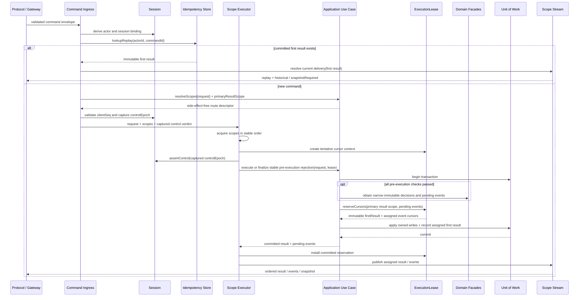
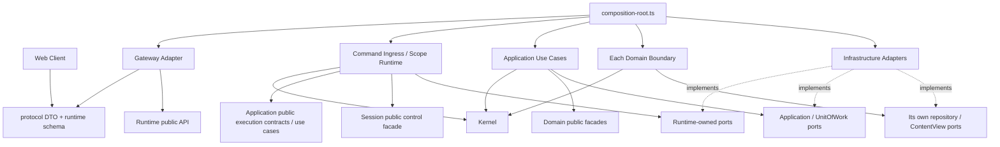

# 北郡 V1 开发计划与模块依赖

> 状态：当前执行计划<br>
> 更新日期：2026-07-19<br>
> 范围：北郡 1–5 级垂直切片<br>
> 上游规则：[产品范围](./product-scope.md)、[系统架构](./architecture.md)、[多人一致性](./multiplayer-consistency.md)、[北郡 V1 设计包](./northshire-v1/README.md)<br>
> 完成依据：[北郡 V1 验收与真人试玩](./northshire-v1/07-acceptance-and-playtest.md)

本文只负责代码边界、依赖、开发顺序、并行方式和工程门禁，不修改北郡 V1 的玩法语义。若计划与 `northshire-v1/00`–`06` 冲突，应先修正规划或回到对应规则所有者文档处理，不能让实现自行选择结果。

## 1. 当前判断

### 1.1 当前进度

> 同步基线：`main@b109146`（M0 workspace 脚手架合入点）

| 范围 | 状态 | 已落地证据 | 下一门槛 |
|---|---|---|---|
| 北郡 V1 | 当前执行；玩法与验收设计已冻结 | [`northshire-v1/00`–`07`](./northshire-v1/README.md) | 按 M0–M7 依次满足工程门禁与验收 |
| M0 | **进行中** | backlog #1–#2；[npm workspace](../package.json)、固定 [Node](../.nvmrc)／[lockfile](../package-lock.json)、server／web／protocol 独立构建，以及基础 [CI](../.github/workflows/ci.yml) | backlog #3：PostgreSQL Compose、首条迁移与 liveness／readiness |
| M1–M7 | 未开始 | — | 先满足前一里程碑退出门槛 |

M0 尚未达到退出门槛：数据库与 readiness、Protocol／Content Schema、FakeClock／RandomSource、完整导入边界和架构契约测试仍待实现。脚手架合入不代表 M0 完成。

### 1.2 起点

计划建立时，仓库已经拥有冻结的产品、玩法、架构和验收文档，但尚无源码、包配置、数据库迁移、自动化测试或 CI。这是计划起点，不是当前状态；实时工程进度以 §1.1 和 §12 为准。

工程脚手架开始前，当前设计包、文档重组和本计划已由 `4f00d10` 保存为独立文档基线。后续工程提交不得同时夹带大规模设计文档搬迁，以便审查规则变化与代码变化。

### 1.3 关键决定

| 主题 | 当前决定 |
|---|---|
| 部署形态 | 保持一个 TypeScript 权威服务端进程和一个 PostgreSQL；不拆微服务。 |
| 代码拆分 | 需要按状态所有权拆代码模块，并在 `World`、`Combat` 内建立封闭子边界。 |
| 包拆分 | 不实行“一领域一个 npm package”；首版只为前后端共享协议建立 `protocol` package。 |
| 开发方式 | 按可演示的纵向切片推进，不按文档编号或模块目录做长周期瀑布开发。 |
| 一致性能力 | 幂等、作用域串行队列、唯一 `CharacterState`、可控时钟／随机源和唯一约束从第一条有状态命令开始存在。 |
| 恢复能力 | checkpoint、lifecycle 和故障注入接口提前建设；后期里程碑只负责闭合全部恢复路径。 |
| 可选 `say` | 第一候选构建默认关闭；核心 P0 全绿后再决定是否加入，不为它预建空的社交体系。 |
| 日历排期 | 先使用依赖和退出门槛排顺序；完成首个真实战斗纵切后，再按实际吞吐估算剩余日历时间。 |

结论是：**需要拆代码边界，但不需要拆部署单元，也不需要把每个边界升级成独立包。**

## 2. 交付目标与完成定义

北郡 V1 的完成不是“模块都建好了”，而是上游定义的以下四层证据同时通过：

1. 自动化规则与内容测试；
2. PostgreSQL、协议、多人和故障恢复集成测试；
3. 真实 Web 客户端 E2E；
4. 累计至少 5 名新测试者的真人试玩。

3–5 客户端组合是候选构建的附加硬门禁，横跨集成与真实客户端 E2E，不另算第五种证据层。

当前实现至少要覆盖这些验收族：

`NS-ENTRY-01`、`NS-NAV-01`、`NS-QUEST-01`、`NS-CONTENT-01`、`NS-COMBAT-01`、`NS-TACTICS-01`、`NS-GROWTH-01`、`NS-MP-01`、`NS-RECOVERY-01`、`NS-REWARD-01`、`NS-INPUT-01`、`NS-SLICE-01`。

以下三类问题一经发现必须停线处理，不能用客户端刷新、人工修档或体验调优绕过：

- 重复经验、任务进度、物品或金币；
- 不同角色之间串档；
- 延迟奖励或旧战斗投影覆盖角色当前的位置、生命、资源、装备或任务状态。

完整 P0 和体验门槛以[验收文档 §11](./northshire-v1/07-acceptance-and-playtest.md#11-通过门槛)为准。

## 3. 代码边界

### 3.1 分层

```text
Web 客户端
    ↓
Protocol + HTTP/WebSocket Adapter
    ↓
Command Ingress + Session
    ↓
Scope Runtime（Scope Executor + Scope Stream）
    ↓
Application Coordinators
    ↓
Session / World / Quest / Combat / Social[optional]
    ↓ 仅依赖端口
PostgreSQL / Content / Clock / Random / Telemetry Adapters
```

各层职责：

| 边界 | 负责 | 不负责 |
|---|---|---|
| Protocol / Gateway | command envelope、运行时 Schema、HTTP/WS、连接 FIFO、结果／事件／快照编码 | 直接访问数据库或裁决玩法 |
| Command Ingress | 协调 actor 推导、命令注册、Idempotency Store 查询、Session 的 `clientSeq` 预检／`controlEpoch` 捕获和 use-case descriptor 路由解析；自身不拥有这些状态 | 修改领域内部对象、维护第二份 scope 规则或另存一份会话／幂等状态 |
| Idempotency Store | `(actorId, commandId)`、规范化 envelope、已提交的首次领域结果和 `primaryResultScope` | 业务规则、连接控制、事件溯源日志、在业务事务外留下永久“执行中”结果或第二次执行命令 |
| Scope Runtime | 唯一负责 `WorldInstance`／character scope 的稳定排序与执行权、执行前 `controlEpoch` 再校验、`ingressSeq`、due 唤醒、scope cursor 的暂存／安装、快照读屏障、当前 delivery 计算和提交后发布 | 开启业务事务、解释领域结果、充当通用事件总线或业务规则引擎 |
| Application | 通过公开 use-case descriptor 声明所需 scopes，负责跨模块编排、Unit of Work、组合领域结果并返回待发布结果／事件 | 自行取得／重入执行权、import 或定位 Scope Runtime、直接广播或保存第二份业务状态；只可使用 Executor 传入的窄 `ExecutionLease` |
| Domain modules | 唯一状态所有权、规则和领域结果 | 依赖 HTTP、WS、PostgreSQL 驱动或客户端代码 |
| Infrastructure | PostgreSQL、内容装载、时钟、随机源、日志与指标的具体实现 | 决定任务、战斗或奖励结果 |
| Web client | 提交意图、展示权威快照和事件、发现序号缺口后请求同步 | 预测并回写移动、伤害、资产或任务状态 |

### 3.2 主模块与内部拆分

现有 [系统架构 §4](./architecture.md#4-模块边界) 的领域边界保持有效。本文固定使用四类术语，不能把它们都称为“模块”：

- **领域模块：**`Session`、`World`、`Quest`、`Combat`，以及启用后的 `Social`；
- **first-class 领域子边界：**`Character`、`Presence & Spawn`、`Inventory & Progression`、`Rewards`；它们有独立门面和导入限制，但仍位于同一个服务端 package 与部署单元。Combat 内的 Scheduler、Tactics、Lifecycle 是封闭内部组件，只能由 Combat 导入，Application 不能绕过 Combat 公共门面调用它们；
- **应用／运行时组件：**Command Ingress、Idempotency Store、Scope Executor、Scope Stream、Application Coordinator；
- **基础设施适配器：**PostgreSQL、Content Catalog、Clock、Random、Telemetry、HTTP／WebSocket。`kernel/` 只是稳定原语集合，不是业务模块。

实现时采用以下封闭边界：

| 边界 | 逻辑所有权 | 对外门面示例 | 实现位置建议 |
|---|---|---|---|
| `Session` | account/session、恢复凭据、连接绑定、会话 `clientSeq`、`controlEpoch` | `authenticate`、`takeControl`、`disconnect`、`assertControl` | `modules/session/` |
| `Idempotency Store` | `(actorId, commandId)`、规范化 envelope、首次结果和主结果 scope | `lookupReplay`、事务内 `recordFirstResult` | `runtime/command-ingress/idempotency-store/` |
| `World / Character` | 唯一 live `CharacterState`、durable snapshot、装载／卸载、永久角色字段的最终写入与字段级合并 | `createCharacter`、`getCharacterView`、`commitLocation`、`mergeCombatVitals`、`safeUnload`、`snapshot`；`loadLive` 仅限边界内部 | `modules/world/character/` |
| `World / Presence & Spawn` | `WorldInstance`、房间、在线可见性、Spawn、`RewardEpoch`、刷新 | `validateMove`、`claimSpawn`、`markTerminal`、`visibleSnapshot` | `modules/world/{rooms,presence,spawn}/` |
| `World / Inventory & Progression` | 普通背包、装备、金币、等级、训练和商店规则；产生窄且不可变的成长／资产 decision | `evaluateEquip`、`evaluatePurchase`、`evaluateTraining`、`evaluateGrant` | `modules/world/progression/` |
| `World / Rewards` | 仅敌人 `RewardEpoch` 的不可变奖励账本、`PersonalLoot`、领取／放弃状态 | `freezeEnemyRewards`、`recordEnemyReward`、`claimPersonalLoot`、`declinePersonalLoot` | `modules/world/rewards/` |
| `Quest` | quest run、目标、知识标记、任务物品栏、`sliceCompleteAt` 规则；只产生任务 decision | `decideAccept`、`decideTurnIn`、`freezeObjective`、`decideFrozenObjective` | `modules/quest/` |
| `Combat` | `CombatSession`／Attempt、唯一运行时投影、动作、威胁、效果、战术和摘要 | `startOrJoin`、`queueOverride`、`advanceTo`、`freezeDefeat`、`abort` | `modules/combat/` |
| `Combat / Scheduler` | `(dueAt, priority, eventSeq)` 堆与可控时钟推进 | `schedule`、`drainDue` | `modules/combat/scheduler/` |
| `Combat / Tactics` | 个人战术、固定 afk 动作引用、受限编辑与关键决策帧 | `view`、`update`、`selectAction` | `modules/combat/tactics/` |
| `Combat / Lifecycle` | checkpoint、participant／attempt lifecycle、reward lock、中止语义 | `checkpoint`、`close`、`abort`、`restartPlan` | `modules/combat/lifecycle/` |
| `Social` | 可选、仅房间瞬时 `say` | `say` | 第一候选构建不创建，启用时再加入 |
| `Persistence` | 事务、迁移、仓储端口实现 | 各模块自行定义的 repository port | `infrastructure/postgres/` |
| `Content Catalog` | 已校验、归一化、只读内容快照和唯一 `content_version` | 实现各消费模块自行定义的窄 `ContentView`；不暴露跨领域万能查询门面 | `infrastructure/content/` |

这里的 `Character`、`Presence & Spawn`、`Inventory & Progression` 和 `Rewards` 都是 `World` 旗下的 first-class 子边界，不是独立服务。其中 Character 的 live／durable／combat projection 合并和 Rewards 的逐敌奖励事务尤其需要独立门面与导入限制；继续把这些职责散落在 World、Combat 和 Persistence 中会形成循环依赖。

`Character` 拥有唯一聚合实例、装载生命周期和永久字段的最终写入／合并入口，不因此接管全部字段规则：任务变化仍由 Quest 决定，成长／资产变化仍由 Progression 决定，敌人奖励账本与 PersonalLoot 仍由 Rewards 决定，Combat 只提供生命／资源投影和冻结结果。Application 只组合这些窄且不可变的 decision；不存在可绕过所有者的通用 `applyDelta`、任意字段 setter 或跨边界可变 `CharacterState`。门面示例只固定职责形状，具体 TypeScript 方法在真实纵切产生第二个消费者或契约测试后再稳定。

字段所有权固定如下；完整字段集合和有效视图以[玩家流程 §2](./northshire-v1/01-player-flow.md#2-核心状态)为准，live／durable／combat projection 的装载、卸载与合并语义以[多人一致性 §9](./multiplayer-consistency.md#9-内存状态与持久状态边界)为唯一正文：

| 状态／字段 | 规则决定者 | 最终写入／合并入口 | 耐久所有者与约束 |
|---|---|---|---|
| account、session、`clientSeq`、`controlEpoch` | Session | Session | Session repository；命令首次结果单独属于 Idempotency Store |
| 角色身份、唯一 live 实例、装载／卸载 | Character | Character | Character durable representation；durable snapshot 不是第二份可独立写入的余额 |
| 位置与普通移动目的地 | World | Character 的具名位置合并入口 | Character durable representation；Presence 只保存在线可见性，不是第二位置真相 |
| active 战斗中的生命、职业资源和瞬态字段 | Combat 的唯一 runtime projection／冻结结果 | active 期间由 Combat projection 变化；只在明确事务边界由 Character 按字段合并 | Character durable representation；Combat 不得整体反写或复制成长、任务、资产 |
| 存活／死亡状态、死亡原因、脱战或 `recover` 后的生命／职业资源 | Combat / Lifecycle 决定 participant 死亡／恢复转换，World 决定恢复目的地，Character 拥有脱战恢复规则 | Character 的具名死亡／恢复 decision 合并入口；同事务推进 Combat participant lifecycle | Character durable representation；Combat lifecycle 单独属于 Combat repository，二者不能互相替代 |
| XP、等级、最大属性、金币、普通背包、装备、训练／已学动作 | Inventory & Progression；Quest／Rewards 只能提供 typed grant | Character 的具名 progression／inventory decision 合并入口 | Character durable representation；禁止通用 delta |
| quest run、步骤、目标、知识、任务物品、`sliceCompleteAt` | Quest | Character 的具名 quest decision 合并入口 | Character durable representation；Quest 不维护第二份角色任务余额 |
| `TacticsLoadout`、`tacticsRevision`、固定 afk 已解析动作引用 | Combat / Tactics | Character 的具名 tactics decision 合并入口 | Character durable representation；CombatStartCheckpoint 的审计副本属于 Combat，永不回写角色配置 |
| `SpawnLifecycleRecord`、`RewardEpoch`、`terminalAt`、`respawnEligibleAt` | World / Spawn | World / Spawn | World repository；已终结代次不可重开 |
| `SpawnInstance.currentCombatSessionId`、世界侧 `idle`／`claimed` 可用性与归属 guard | World / Spawn runtime | World / Spawn runtime | 仅内存；崩溃后不恢复旧 owner，启动时按 durable lifecycle 重新分类 |
| `EnemyParticipant` 的 active／resolving 状态、生命、威胁、效果与阶段触发 | Combat / EnemyParticipant runtime | Combat / EnemyParticipant runtime | 仅内存，不逐 tick 恢复；`reset_detached` 时 World 先校验 owner，Combat 作废／清理旧 participant，World 最后清空归属并回到 `idle` |
| reward ledger、`PersonalLoot` pending／terminal | Rewards | Rewards | Rewards repository；不得保存 XP、金币、任务或背包余额 |
| `CombatSession`、Attempt／Participant lifecycle、checkpoint | Combat / Lifecycle | Combat / Lifecycle | Combat repository；不得形成第二份 `CharacterState` |

WorldInstance／character scope queue 是**执行排序所有者**，Character 是**永久角色字段写入所有者**；二者不是两份状态，也不能互相替代。

`Recovery` 不建立一个拥有复制状态的新领域模块。恢复行为由 application coordinator 在同一 Unit of Work 中协调 Session、World、Combat、Quest 和 Rewards，并通过各自 ports 持久化；各模块只拥有自己的状态与状态机，Persistence adapter 不参与裁决。

### 3.3 共享内核

`kernel/` 或 `shared/` 只能包含：

- 稳定 ID 类型；
- `ExecutionScopeKey` 等稳定 scope 标识、`Clock`、`RandomSource`；
- transaction context；
- 小型结果／错误原语；
- 无业务含义的集合或测试工具。

房间规则、任务判断、战斗公式、奖励资格和角色字段合并不得放入 shared helper。出现跨模块循环时，应把用例协调上移到 application，而不是扩大 shared。

## 4. 模块依赖关系

下面两类图不能混用：运行时图说明一次请求实际经过谁，源码图说明 TypeScript 文件允许 import 谁。端口实现箭头不代表领域模块在运行时反向调用基础设施。

### 4.1 运行时调用与提交顺序



每个 Application public use-case descriptor 唯一声明 `resolveScopes` 和 `primaryResultScope`；Command Ingress 只调用这份无副作用路由契约，不能维护第二份 scope 规则。Scope Executor 是 scope 排序和执行权的唯一所有者，取得执行权后必须再次调用 Session `assertControl(capturedControlEpoch)`。若代次已变化，Application 使用同一 Unit of Work／cursor reservation 路径持久化稳定拒绝和首次结果，但不进入领域逻辑；因此旧命令重试不会在新控制连接下重新执行。

Application 不能 import、查找或重入 Runtime。它只使用 Executor 传入、由 Application public contract 定义的窄 `ExecutionLease`：在领域 decision 和 pending events 已形成后，lease 为每个受影响 scope 暂存连续事件序号，并以主结果 scope 分配后的裁决后游标返回不可变 `firstResult(scope, scopeEpoch, serverSeq)`。这次 reservation 在 scope 执行权释放前对外不可见；Application 将分配后的 first result 与业务状态写入同一事务。commit 后 Executor 才安装全部 reservation 并交给 Scope Stream 发布；rollback 或唯一冲突会全部丢弃，既不推进可见 cursor，也不产生序号缺口。若主结果 scope 没有事件，无事件拒绝等结果的 `serverSeq` 保持为该 scope 裁决后的当前 cursor。

Scope Stream 负责 cursor、FIFO、可见性和每次送达的 `delivery`。幂等命中只跳过队列和领域执行，不能绕过 Scope Stream：它必须依据当前 scope epoch 与可见基线重新计算 `historical`／`snapshotRequired`，同时保持持久 `firstResult` 不变。

Ingress 可以在事务外查询已经提交的 replay，并可用进程内 promise 合并同进程的并发首次请求，但不能在事务外留下永久完成标记。lookup miss 后，Application 必须在同一 Unit of Work 中再次以唯一约束保护 `(actorId, commandId)`，并原子写入业务状态和首次结果；回滚不留下首次结果，唯一冲突则读取已经提交的首次结果。任何永久成功、`defeated` 或终态奖励只能在 commit 后由 Scope Stream 发布。

同一个 Idempotency Store 通过两个消费方定义的窄 port 使用：Runtime 定义只读 `ReplayLookup`，Application／Unit of Work 定义事务内 `FirstResultWriter`，PostgreSQL adapter 对同一张逻辑存储实现二者。Application 不为写首次结果而 import Runtime，Ingress 也不能获得事务写入门面。

### 4.2 源码 import 与端口实现方向

下图中实线表示“允许 import”，虚线表示“实现该层定义的 port”；除 `composition-root.ts` 外，任何文件都不能同时越过领域边界导入具体实现。



| 源码区域 | 允许 import | 禁止 |
|---|---|---|
| Web | `packages/protocol`、Web 自身代码 | 服务端领域或基础设施实现 |
| Gateway | protocol、Runtime 公共入口 | Application／Domain 具体实现、数据库 |
| Runtime | kernel、Application 公共执行契约／用例、Session 的公共控制门面、自身定义的 ports | Session 以外的 Domain、任何 Domain 内部、Infrastructure 具体实现；Application 也禁止反向 import Runtime |
| Application | kernel、领域根 `public.ts`、允许的 first-class 子边界 `public.ts`、自身定义的 Unit of Work ports | Runtime、sealed 领域内部文件、Infrastructure 具体实现 |
| 每个领域边界 | kernel、自身内部、自身定义的 repository／`ContentView` ports | 其他领域内部、HTTP／WS、PostgreSQL 驱动、客户端代码 |
| Infrastructure | 要实现的 Domain／Application／Runtime ports、外部库 | 定义或裁决任务、战斗、资格、奖励规则 |
| `composition-root.ts` | 所有具体实现，仅用于装配 | 承载业务规则或运行时状态 |

跨边界 import 只允许两类明确入口：领域根 `modules/<domain>/public.ts`，以及已列入 §3.2 的 World first-class 子边界 `modules/world/{character,rooms,presence,spawn,progression,rewards}/public.ts`。Application 可以直接组合这些 public；其他 `modules/**` 深层路径全部是内部实现。`modules/combat/{simulation,scheduler,tactics,lifecycle}/**` 只允许 Combat 自身导入，不能从 Application 直连。除 Command Ingress 经 Session 公共控制门面完成 actor／连接／序号校验外，领域模块之间不直接读取对方的表、内部类或可变对象，跨模块命令只由无状态 application use case 组合公开门面。World、Quest 和 Combat 各自定义所需的只读 `ContentView` port，`infrastructure/content` 负责实现；领域代码不能反向导入 infrastructure。

World 内部把 Character、Presence & Spawn 组、Inventory & Progression、Rewards 视为同级边界，默认禁止彼此 import；跨边界写入仍由 Application 协调。`rooms`／`presence`／`spawn` 组内可以通过该组自己的内部契约形成单向依赖，但必须无环，也不能把 Character、Progression 或 Rewards 变成下游依赖。Combat root 可以组合自己的 sealed 组件，sealed 组件不能反向 import Combat public 或任何其他领域边界。

跨 Runtime／Application 的类型所有权固定如下，防止为共享类型制造反向依赖：

- kernel 拥有 `ActorId`、`CharacterId`、`ExecutionScopeKey` 等稳定值类型，不拥有命令结果、事件或锁实现；
- Application public 拥有 `UseCaseDescriptor`（含 `resolveScopes`／`primaryResultScope`）、`UseCaseRequest`、`UseCaseOutcome`、`PendingEvent`、`FirstResultRecord` 和窄 `ExecutionLease` contract；Runtime 只 import 并实现／调用这些契约；
- Runtime 拥有队列、cursor reservation 实现、Scope Stream 和只读 `ReplayLookup` port；`ReplayLookup` 复用 Application public 的 `FirstResultRecord`，不重新定义记录 Schema；
- Session public 控制门面只接收 kernel ID、`clientSeq`／`controlEpoch` 值对象，不接收 WebSocket、protocol adapter 或 Runtime 内部类型；
- `packages/protocol` 只拥有网络 DTO 与运行时 Schema；Gateway 在 protocol DTO 和 Application public 请求／结果之间映射，Domain 与 Application 不 import 客户端或传输实现。

### 4.3 关键跨模块用例

下表中的 scopes 只由 Scope Runtime 按稳定顺序取得。每个有持久副作用的用例都必须把首次幂等结果与业务变化写入同一事务，表中不再逐行重复。

| 用例 | 所需 scopes | 协调顺序 | 提交边界 |
|---|---|---|---|
| 创建角色 | `account:{accountId}` | Session 校验账号 → Character 建立唯一初始状态 → 记录命令首次结果 | 一个事务和账号级唯一约束，禁止半成品或第二角色 |
| 移动 | `instance:{instanceId}` | World 验证出口／状态 → Character 更新持久位置 → 提交成功后 Presence 更新订阅 | 位置提交后才让内存成员关系生效并广播离开／进入；提交失败保持原成员关系 |
| 任务交付 | character，必要时 instance | Quest 产生交付／任务奖励 decision → Inventory/Progression 产生 typed grant decision → Character 合并 quest 与资产字段 | 任务、物品、XP、金币和幂等结果同事务；不写敌人 Rewards ledger |
| 开始／加入战斗 | `instance:{instanceId}` | Character 提供权威视图 → World 认领 Spawn → 持久 `CombatStartCheckpoint` 成功 → Combat 创建 participant → 捕获 `TransientCombatCheckpoint` → 此后才允许动作扣费或产生效果 | WorldInstance 单写者内完成；Combat 不另建队列；检查点失败则拒绝加入 |
| 敌人击败结算 | instance + 相关 character | Combat 读取冻结资格 → World 终结 Spawn／RewardEpoch → Rewards 写逐敌账本／PersonalLoot → Quest 产生冻结目标 decision → Inventory/Progression 产生 typed grant decision → Character 合并永久字段 → Combat 推进 lifecycle | 同一数据库事务；成功后才广播 `defeated` 和永久奖励；精确锁序、唯一键与故障语义以[恢复规格 §8](./northshire-v1/06-multiplayer-and-recovery.md#8-奖励事务与幂等)为准 |
| `recover` | instance + character | Combat / Lifecycle 验证 participant `defeated → recovered` → World 提供庭院目的地 decision → Character 合并死亡、生命／资源与位置字段 → Combat 推进 participant lifecycle | 角色状态、位置与 participant 结果同事务；Application 只协调，不决定资格或目的地；既有资格、`unresolvedRewardEpochs` 和 reward lock 保留到对应结算终态；重试只返回首次结果 |
| 重连快照 | character + 当前可见 scopes | Session 接管并递增 `controlEpoch` → Runtime 取得稳定读屏障 → 组合 Character／World／Quest／Combat／Rewards → 先订阅并把快照入 FIFO | 释放屏障后才允许后续增量入队 |
| 进程启动恢复 | readiness 之前 | 加载内容／迁移 → 恢复 Character／Spawn／Attempt lifecycle → 生成新 `scopeEpoch` → 建立实例 | 完成后才开放命令入口；不恢复逐 tick 时间线 |
| `slice.complete` | instance + character | World 验证 NS11 南边界 → Quest 先按既有 `sliceCompleteAt` 短路；仅首次触发再验证 #54 为 `active` → Character 首次写入时间 | 幂等事务；完成后放弃／重接 #54 仍返回首次结果；不跨区、不交付 #54、不发奖励 |

### 4.4 禁止依赖

- Gateway 不能直接访问 PostgreSQL、领域对象或数据表。
- Application 不能 import、定位或重入 Scope Runtime，也不能自行取得执行权或发布；唯一例外是使用 Executor 传入、由 Application public 定义的非重入 `ExecutionLease` 暂存 result cursor。
- Session 不能拥有位置、生命、任务、背包或战斗结果。
- Combat 不能导入 Character、World、Quest 或 Rewards 的内部对象／仓储。
- Combat runtime projection 不能整体覆盖 `CharacterState`。
- Quest 不能直接写普通背包、金币或经验余额。
- Rewards ledger 不能保存第二份角色余额；它只保存幂等事实和 pending／terminal 掉落状态。
- Content Catalog 不能暴露让任一领域读取全部内容类型的万能门面；消费模块必须定义自己的窄 `ContentView`。
- Persistence 不能包含任务、战斗、资格或掉落判断。
- 定时器回调只能唤醒 WorldInstance 队列，不能直接修改 Combat 或 World。
- 事务提交前不能发送永久成功、`defeated` 或终态奖励事件。
- cursor reservation 在 commit 前不能对外可见，rollback 后不能留下 cursor 缺口；commit 后也不能重新计算已经持久化的 `firstResult.serverSeq`。
- 幂等 replay 不能由 Ingress 直接送达 Gateway；必须经 Scope Stream 依据当前 scope epoch／可见性重建 `delivery`，但不得重新进入领域队列。
- 首次幂等结果不能在业务事务外标记为完成；回滚后不得留下可重放的成功结果。
- 客户端、生成式 AI 和后台任务不能绕过 command ingress 直接改库。
- 首版不能引入模块间网络调用、消息队列、通用事件总线或分布式锁。

## 5. 建议仓库结构

```text
apps/
  server/
    src/
      kernel/
      runtime/
        command-ingress/
        scope-runtime/
          executor/
          stream/
      application/
        commands/
        coordinators/
      modules/
        session/
        world/
          character/
          rooms/
          presence/
          spawn/
          progression/
          rewards/
        quest/
        combat/
          simulation/
          scheduler/
          tactics/
          lifecycle/
      infrastructure/
        postgres/               # 按所实现的 port 分目录，禁止 generic repository
        content/
        telemetry/
      composition-root.ts
    migrations/
    test/
  web/
    src/
packages/
  protocol/              # 只共享 DTO 与运行时 Schema，不共享领域对象
content/
  northshire-v1/         # 显式数据，不从 Markdown 运行时解析
tests/
  e2e/
  fixtures/
compose.yaml             # 本地只启动 PostgreSQL
```

首版不需要 Nx、Turborepo、DI 框架或 package-per-domain。目录门面、受控 export 和导入边界测试足以约束模块。

### 5.1 物理边界与自动检查

M0 必须把第 4 节的规则变成可执行门禁，而不是只依赖代码评审：

1. 领域公共入口只允许 `modules/<domain>/public.ts` 和明确枚举的 `modules/world/{character,rooms,presence,spawn,progression,rewards}/public.ts`；它们只暴露只读 DTO、窄 decision 和用例所需能力。Combat 内部组件及其他 `modules/**` 深层路径不对 Application 开放。
2. 根级 dependency-cruiser 配置检查循环依赖、上述入口白名单、World 同级子边界互相 import、跨边界 deep import、Application 反向导入 Runtime、sealed Combat 组件外泄，以及除 `composition-root.ts` 外同时导入基础设施具体实现与领域实现的文件。
3. ESLint 针对领域目录禁止 `pg`、HTTP／WebSocket 框架、`Date.now()`、`Math.random()`、`setTimeout`／`setInterval` 和 `process.env`；领域时间、随机数和调度只能使用注入端口。
4. PostgreSQL adapter 按其实现的领域／运行时 port 组织；禁止提供能跨表任意读写的 generic repository 或把 SQL row 当领域对象向外暴露。
5. 架构契约测试至少覆盖“use-case descriptor 唯一解析 scopes → Scope Executor 取得执行权 → 再次校验 `controlEpoch` → ExecutionLease 暂存 cursor → Application 事务写业务状态与已分配首次结果 → commit → 安装 cursor → Scope Stream 发布”的顺序；还要覆盖 replay delivery 重算，以及回滚后既无业务变化／可重放成功结果，也无 cursor 缺口。

这些工具在脚手架建立后才存在；当前文档基线不声称已经有可执行的 TypeScript 边界检查。

### 5.2 推荐工程默认值

这些是 M0 的推荐起点，不是玩法契约。跨项目工具链在 M0 固定；只服务于后续单个模块的选型可在进入该模块前按实际证据决定。替换时记录理由，但不为假设中的替换预建抽象层。

| 类别 | 推荐默认 |
|---|---|
| Runtime | 仓库固定一个受支持的 Node.js LTS，TypeScript strict |
| Workspace | npm workspaces 与单一 lockfile |
| HTTP / WebSocket | Fastify 与成熟 WebSocket adapter |
| 运行时 Schema | Zod |
| PostgreSQL | `pg` 加成熟的版本化 SQL migration 工具 |
| 单元／集成 | Vitest |
| 浏览器 E2E | Playwright Chromium |
| Web | Vite + 最小 React 终端；不引入额外状态框架或设计系统 |
| 内容 | 显式 JSON，经 Schema 和引用校验后归一化为只读对象 |
| 日志 | Pino 或等价结构化日志 |
| 本地基础设施 | Docker Compose 只提供 PostgreSQL |

脚手架提交必须固定实际版本、锁文件和 Node 版本，不能依赖开发者机器上偶然安装的版本。

## 6. 里程碑与依赖

```text
M0 工程基座
  → M1 权威入口与可重连 walking skeleton
      → M2 世界、内容与第一条非战斗任务
          → M3 第一条真实战斗任务与奖励
              → M4 完整单人北郡
                  → M5 共享世界与双人战斗
                      → M6 断线、崩溃与恢复闭环
                          → M7 候选构建与真人验收
```

### M0：工程与设计基线

> 当前状态：**进行中**。backlog #1–#2 已完成，并已建立基础 format／lint／typecheck／test／CI；以下交付与退出门槛仍按完整 M0 口径验收。

交付：

- 独立文档基线提交；
- workspace、严格 TypeScript、单一 lint／format 组合和导入边界检查；
- 各边界 `public.ts`、源码依赖矩阵、循环／deep import 检查和领域禁用 API 规则；
- `.gitattributes`、`.gitignore`、`.env.example` 和固定 Node 版本；
- PostgreSQL Compose、空数据库迁移、健康检查和 readiness；
- protocol／content Schema 骨架；
- FakeClock、固定 RandomSource、故障注入 seam；
- CI 能安装、构建、迁移并运行第一条测试；
- 最小架构契约测试证明 scopes 只有一个 resolver、执行前再次校验 `controlEpoch`、已分配 `firstResult.serverSeq` 与业务状态同事务、commit 后才安装 cursor／发布，并且 replay delivery 使用当前 scope 状态重算。

退出门槛：

- 从空数据库执行全部现有迁移成功；
- 内容校验失败时 readiness 为 false，服务不接受游戏命令；
- 相同 FakeClock／seed 的示例规则运行结果完全一致；
- server、web 和 protocol 可以独立构建；
- 构造的非法跨层、循环、deep import 与领域基础设施依赖都会被 CI 稳定拒绝；
- 故障注入使事务回滚时，领域状态、首次结果和发布事件均保持未提交。

M0 只固定依赖方向、`public.ts` 入口约定、公共 envelope、稳定 ID 和内容 Schema 外壳，不凭空冻结所有模块 façade。具体方法随 M1–M3 的真实纵切形成，在出现第二个真实消费者或契约测试后再稳定。M2 建立通用字段／引用校验，北郡发布包的完整记录与精确数量契约在 M4 收口。M1 的两房间 fixture 仅用于测试环境，不能进入候选构建或冒充通过 `NS-CONTENT-01`。

### M1：权威入口与可重连 walking skeleton

交付：

- `CommandEnvelope`、结果、事件、scope cursor 和稳定错误结构；
- command registry、actor scope、幂等日志与 `primaryResultScope`；
- Session、预置测试账号、单角色创建、`controlEpoch`；
- WorldInstance／character 串行执行器和提交后发布；
- 唯一 live `CharacterState` 与 durable snapshot；
- 最小 Web 终端完成连接、创建、`look`、两房间 fixture 移动和重连；
- 快照先订阅、后释放屏障的最小正确路径。

退出门槛：

- 同一完整 envelope 重试只返回首次结果；改变载荷稳定冲突；
- 新连接接管后，旧连接和旧 `controlEpoch` 命令都不能改变角色；
- 移动后断线重连，位置和 cursor 与服务端权威状态一致；
- 至少一条真实浏览器 E2E 从账号进入到可操作房间。

对应验收：`NS-ENTRY-01`、`NS-INPUT-01` 的基础部分。

### M2：真实世界骨架与第一条非战斗任务

交付：

- 把 #783／#7 纵切所需的真实内容及 11 个房间人工转录为显式数据，不编写 Markdown 运行时解析器或使用虚构的生产记录；
- 建立通用内容 Schema、稳定 ID、引用、房间图、统一 `content_version` 和 V1 精确清单校验器；完整发布清单在 M4 启用为硬门禁；
- 11 个房间，以及当前纵切所需的 NPC、敌人出生点和可见性；
- `look`、`exits`、`go`、房间进入／离开广播；
- #783 的对话、知识、接取、交付和后续解锁；
- 非战斗状态的持久位置、任务和完整快照。

退出门槛：

- 当前真实内容子集的 Schema、ID、来源和引用错误数为 0；不得把子集标记为完整通过 `NS-CONTENT-01`；
- 从 NS02 到所有必达目标和 NS11 可达；
- #783 成功、非法前置、重复提交和重连路径全部通过；
- 两名客户端同房间的进入／离开最终一致。

对应验收：`NS-CONTENT-01` 的结构／引用基础部分、`NS-NAV-01` 和 `NS-QUEST-01` 的基础部分。

### M3：第一条真实战斗任务与奖励

交付：

- 确定性 scheduler、动作生命周期、读条、资源、威胁和摘要；
- 战士／法师的最小真实动作与默认战术；
- 单人 Vermin 战斗和 #7 的真实击杀推进；
- Spawn 认领、`CombatStartCheckpoint`、`TransientCombatCheckpoint` 和唯一 runtime projection；
- 从首个 Attempt 起持久化 `CombatAttemptLifecycle`（`active | reward_pending | closed`）、`CombatParticipantLifecycle`、`SpawnLifecycleRecord` 与 `unresolvedRewardEpochs`／reward lock；participant 的瞬态检查点必须在创建后、首个动作成本或效果前捕获；
- 逐敌冻结资格、XP／铜币／任务／PersonalLoot 原子结算；
- 领取／放弃、刷新、不自动连战；
- 事务提交失败、提交成功但响应丢失、延迟结算的首批故障 seam；真实进程重启分类与完整恢复留在 M6。

退出门槛：

- 相同初态、时钟、seed 和命令序列重复 100 次，状态与结构化事件相同；
- 同一 `(SpawnInstanceId, RewardEpoch)` 在重复命令和故障窗口下只结算一次；
- Combat 不保存或整体反写 XP、任务、背包、装备和金币；
- 第一条真实路径完成“接任务 → 战斗 → 奖励 → 重连”。

对应验收：`NS-COMBAT-01`、`NS-REWARD-01` 的基础部分，以及 `NS-QUEST-01` 的击杀目标部分。

### M4：完整单人北郡

交付：

- 补齐并校验完整发布清单，再实现对应运行行为：10 条任务、6 类敌人、20 个固定敌人出生点、8 个 Harvest Node、12 个 ability 和 27 个 item；
- 战士／法师完整 1–5 级动作，以及所有记录对应的任务、战斗、物品与成长规则；
- 个人战术查看、受限编辑、reset、关键决策帧和固定 afk 动作引用；
- 全部敌人 AI、Young Wolf、Worker、Garrick 和多敌逐敌结算；
- 背包、任务物品、装备、商店、训练、经济、升级和魔法水；
- `flee`、0 HP、幂等 `recover`；
- #54 与 `sliceCompleteAt` 完整幂等路径。

退出门槛：

- [玩家流程 Scenario A、E](./northshire-v1/01-player-flow.md#7-必须跑通的端到端场景)及 Scenario D 的单人子路径通过；Scenario D 的双人分支留给 M5；
- `NS-CONTENT-01` 的精确数量、ID 集合、来源、引用和内容图错误数全部为 0；
- 无额外刷怪达到 5 级，装备、训练和经济分布符合冻结规格；
- 六项冻结战斗边界的自动化及当前可执行的单客户端部分通过；旁观、双人和断线相关部分分别在 M5、M6 收口，完整候选专项在 M7 执行；
- 单人黄金路径无软锁、无重复奖励、无管理员修档。

对应验收：`NS-GROWTH-01`、`NS-TACTICS-01`、`NS-SLICE-01` 及单人范围的全部验收族。

### M5：共享世界与双人战斗

交付：

- 第二名玩家加入同一 `CombatSession`；
- 累计两人名额与第三人旁观／容量拒绝；
- 两人相同公开事件顺序、独立 CharacterState 与独立个人奖励；
- 同一 WorldInstance 内两场 CombatSession 互不污染；
- 多房间移动、任务和战斗并发；
- 3、4、5 客户端测试夹具。

退出门槛：

- [玩家流程 Scenario B](./northshire-v1/01-player-flow.md#scenario-b两人同一-combatsession)通过；
- A/B 各自只获得一次完整经验、任务进度和个人掉落；
- C 的私有任务、知识、资产和成长不被覆盖；
- 第三名玩家、两场并发战斗和响应丢失重试的结果唯一。

M5 只完成[验收 §8](./northshire-v1/07-acceptance-and-playtest.md#8-35-人多人测试组合)的无故障多人核心部分。战斗断线、奖励广播前后重连和完整故障组合由 M6 实现；每种组合连续 10 轮的正式门槛在 M7 执行。

对应验收：`NS-MP-01` 的无故障核心，以及 Scenario D 的双人分支和六项边界中的旁观／双人部分。

### M6：断线、崩溃与恢复闭环

交付：

- 战斗断线切换固定 `afk_profile`；
- queued 覆盖无成本取消，started 动作按原 `resolvesAt` 恰好一次；
- reward lock、延迟奖励与 `COMBAT_REWARD_PENDING`；
- 一致快照、逐 scope epoch／cursor、旧连接撤权；
- restart recovery、`respawnEligibleAt`、reward／escape abort；
- 安全离线、唯一 live 装载、与重连／延迟奖励并发；
- 非战斗断线宽限、魔法水 tick 的继续／取消，以及安全卸载时的持久化边界；
- Battle Shout／Frost Armor 和 ability 专属冷却在同进程重连中保留、在安全离线后重新进入或进程重启后清除；
- 全部关键提交窗口的重复故障注入。

退出门槛：

- [玩家流程 Scenario C](./northshire-v1/01-player-flow.md#scenario-c战斗中断线)和[验收 §7.3](./northshire-v1/07-acceptance-and-playtest.md#73-死亡恢复与奖励资格边界)通过；
- 事务提交前退出、提交后广播前退出和内存战斗丢失均产生唯一、符合冻结恢复契约的结果：未提交结果不补造，已提交结果不丢失也不重复；
- 重复资产、角色串档、reward lock 泄漏和旧投影覆盖均为 0；
- `multiplayer-consistency.md §12.1` 的 v1 验证项全部通过。

对应验收：`NS-RECOVERY-01`、`NS-REWARD-01` 和 `NS-MP-01` 的故障范围。

### M7：候选构建与真人验收

交付：

- 完整 Web 文字终端、固定反馈、帮助、战术入口、摘要和重连体验；
- 最小结构化日志、指标和验收遥测；
- 完整黄金路径、非法路径、六项边界专项和切片冒烟；
- 3–5 人组合连续测试；
- 累计至少 5 个新测试者的独立完整流程；完成时间中位数为 60–90 分钟，至少 80% 落入该区间，成功完成者不超过 105 分钟；
- 保留原始失败结果、修复动作和独立复测报告。

退出门槛：

- [验收文档 §5–§11](./northshire-v1/07-acceptance-and-playtest.md#5-自动化验收)全部适用项为 `PASS`；
- `BLOCKED` 与 `NOT_RUN` 均为 0；
- P0 和体验门槛同时通过；
- 只有此时才把北郡 V1 标记为完成。

## 7. 并行开发方式

M0 完成并固定依赖方向、公共入口约定、公共协议、内容 Schema 外壳和稳定 ID 后，可以采用以下并行线；具体模块门面随 M1–M3 纵切形成，北郡发布包的完整内容 Schema 在 M2 收口：

| 工作线 | 可并行工作 | 必须等待的接口 |
|---|---|---|
| A：运行时与持久化 | Session、Idempotency Store、scope runtime、迁移、事务和故障注入 | Kernel、CommandEnvelope、repository ports |
| B：内容与规则 | 内容转录、引用校验、Quest 纯状态机、Combat 纯模拟 | Content Schema、稳定 ID、Clock／RandomSource |
| C：Web 客户端 | 终端、连接状态、命令输入、快照 reducer、错误反馈 | Protocol DTO、快照／事件 Schema |
| D：验收与工具 | 内容图校验、seed runner、集成 fixture、Playwright、报告产物 | 验收 ID、可注入接口、稳定命令入口 |

收敛点必须按顺序发生：

1. M1：A + C 合并为可重连 walking skeleton；
2. M2：A + B + C 合并为完整导航与 #783；
3. M3：Combat、Quest、World、Rewards 首次在真实事务中汇合；
4. M4：内容和两职业分支并行扩充后，统一跑单人黄金路径；
5. M5/M6：多人和故障路径只在单人结算与生命周期稳定后收口；
6. M7：自动化、集成和浏览器冒烟先通过，再开始正式真人试玩。

不能把一个开发者长期绑定为“只写 World”或“只写 Combat”而数周没有可运行结果。日常 issue 应尽量是跨层的小纵切，例如“#783 接取并在重连后恢复”，并明确调用哪些已有模块门面。

## 8. 测试与 CI 门禁

### 8.1 每个 PR

1. 冻结 lockfile 安装；
2. format、lint 和 typecheck，包括领域目录禁用基础设施／系统时间／随机数／原生 timer／环境变量 API；
3. dependency-cruiser 检查允许的 import 矩阵、领域根／枚举子边界 `public.ts` 入口、sealed Combat 组件、跨边界 deep import、循环依赖和 `composition-root.ts` 唯一装配例外；
4. 命令管线架构契约测试，验证唯一 scope resolver、执行权内再次校验 `controlEpoch`、cursor reservation、业务状态与首次结果同事务、回滚、commit 后安装／发布和 replay delivery 重算；
5. Markdown 本地链接检查；
6. 始终运行内容 Schema、当前数据引用和图校验；M4 合入完整发布包后，再把 V1 精确数量／ID 清单设为永久 PR 门禁；
7. 全部快速领域单元测试；
8. 空 PostgreSQL 全量迁移；
9. 全部核心 repository／事务／协议／WS 集成测试；
10. server、web 和 protocol production build；
11. Playwright Chromium 最小冒烟。

### 8.2 Main nightly / 候选构建

- 每职业 × 每种不会逃离的普通敌人模板至少 30 个 seed，Garrick 基准路径另按每职业至少 30 个 seed，并执行冻结经济分布矩阵；
- 同一有状态命令以同一幂等 ID 重复提交 1,000 次；
- 任务交付、敌人击败、拾取和升级奖励每类至少执行 100 个故障注入样本；
- 3、4、5 客户端各 10 轮组合；
- 完整单人黄金路径、非法路径、恢复专项和完整切片冒烟；
- 保存 build ID、`content_version`、migration version、seed 和证据路径。

不设置一个全局覆盖率百分比替代验收。测试名称或元数据必须标注对应 `NS-*` 验收 ID；任何 P0 修复都必须先有最小复现，再合入回归。

## 9. 日常开发规则

每个 issue 至少写明：

- 玩家或系统可观察结果；
- 规则所有者文档与 `NS-*` 验收 ID；
- 涉及的状态所有者和 application coordinator；
- 明确非目标；
- 自动化、集成或 E2E 证据；
- 是否涉及 Schema、migration 或 `content_version`。

每个 PR 应满足：

- 修改范围能直接追溯到 issue；
- 新规则先有失败测试或可重放样本；
- Schema／migration／内容兼容变化在同一 PR 中完整处理；
- 永久状态与首次结果同事务提交，之后才由 Scope Stream 广播成功；
- 不新增未进入 V1 的 `[later]` 生产路径；
- 不顺手重构无关模块。

Bug 修复流程：最小复现 → 确认状态所有者／故障窗口 → 修复 → 重跑对应验收族 → 记录是否需要扩大回归。重复奖励、串档和旧投影覆盖直接按 P0 处理。

## 10. 主要风险与应对

| 优先级 | 风险 | 计划内应对 |
|---|---|---|
| P0 | live CharacterState、durable snapshot 和 combat projection 相互覆盖 | 唯一 live owner、字段级 delta、禁止整体反写；M3 起持续测试延迟奖励与重连并发 |
| P0 | 击败结算跨 World／Quest／Combat／Rewards，出现循环或部分成功 | 独立 application coordinator、固定锁序、冻结快照、单事务、唯一键、提交后由 Scope Stream 广播 |
| P0 | Node 定时器和异步 DB 让命令／内部事件乱序 | WorldInstance 单写者；定时器只唤醒；FakeClock 验证 `dueAt <= ingressAt` |
| P0 | 重连快照与后续增量之间出现交接空窗 | 同一切面 cursor；读屏障内先订阅并把快照入唯一 FIFO |
| P0 | abort／重启留下孤儿 participant、旧 Spawn 或永久 reward lock | 显式 lifecycle；readiness 前恢复；每个提交窗口做故障注入 |
| P1 | World 与 Combat 成为 God module | Character、Rewards、Tactics、Scheduler、Lifecycle 使用封闭子目录和公开门面 |
| P1 | 内容 ID／版本漂移破坏存档 | 启动与 CI 全量校验；稳定字符串 ID；破坏性变化必须迁移 |
| P1 | 先填完整内容，最后才发现核心循环不可行 | M3 先完成一条真实任务／战斗／奖励／重连纵切，再扩展全部内容 |
| P2 | 单 WorldInstance 队列成为热点 | V1 先观测；只有 ADR 触发条件成立后才考虑按实例拆运行单元 |

## 11. 当前明确不做

- 微服务、Redis、消息队列、CQRS、事件溯源、Saga 和分布式锁；
- 一领域一个 workspace package、DI 框架和通用事件总线；
- 每个战斗 tick 落库或完整离线事件回放；
- 通用任务脚本语言、规则 DSL、热更新、内容 CMS 和在线编辑器；
- 自动从 Markdown 生成运行内容；
- Party、Trade、CompanionController／AI 队友、生成式 AI 文字或规则裁决、Telnet、Tauri 和公开账号生命周期；
- 北郡外地区、额外职业／种族、正式组队／副本、共享掉落、跑尸／耐久、PvP 和公开发行；
- 为 `say`、Social 或生成式 AI 建空接口体系；
- React 设计系统、SSR、复杂客户端状态框架和无关多浏览器矩阵；
- 为 V2 的 `[later]` 字段提前建表或生产代码路径。

## 12. 首批可执行 backlog

1. [x] 保存独立文档基线提交，并确认 Markdown 链接与行尾策略（`4f00d10` 文档基线；`.gitattributes` 固定行尾）；
2. [x] 建立 npm workspace、固定 Node／lockfile、server／web／protocol 构建（`b109146` workspace 脚手架）；
3. [ ] 建立 PostgreSQL Compose、第一条迁移、liveness／readiness；
4. [ ] 建立 Protocol 与 Content Schema、稳定 ID 和 `content_version`；
5. [ ] 建立 Kernel、FakeClock、RandomSource 和模块导入边界；
6. [ ] 实现 command registry、actor scope、Idempotency Store 和 scope runtime；
7. [ ] 实现预置账号、角色创建、唯一 CharacterState 和控制权接管；
8. [ ] 用真实 Web 客户端跑通 `look → go → reconnect`；
9. [ ] 转录 #783／#7 所需真实内容和 11 个房间，跑通结构／引用校验与导航；
10. [ ] 实现 #783 的非战斗任务纵切；
11. [ ] 实现 Vermin／#7 的首条确定性战斗与奖励纵切；
12. [ ] 在扩充其余内容前，先通过“奖励已提交但响应丢失”和“延迟奖励不得覆盖当前 CharacterState”两条 P0 故障测试；
13. [ ] 补齐完整 V1 内容清单，正式启用 `NS-CONTENT-01` 精确数量／ID 门禁，再进入 M4 的完整运行行为。

backlog 勾选只表示对应单项已经落地；M0 是否完成仍以 §6 的 M0 退出门槛为准。

完成第 11–12 项后，使用真实 issue 周期、测试耗时和缺陷密度估算 M4–M7；在此之前不承诺缺少依据的日历日期。
