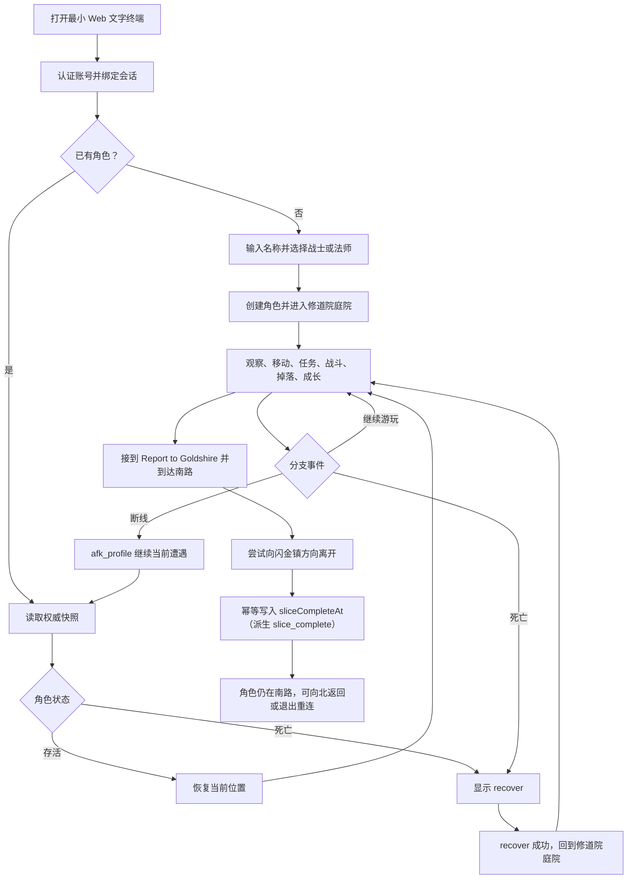

# 北郡 v1：完整玩家流程

> 状态：当前执行流程
> 适用范围：从首次连接／创建角色到首次写入 `sliceCompleteAt`，包含死亡与断线恢复
> 上位契约：[北郡 v1 垂直切片契约](./00-slice-contract.md)
> 显式协议依赖：[多人一致性 §3–4、§8、§10](../multiplayer-consistency.md#3-连接与会话)，作为 v1 的 actor、命令／结果／事件、幂等与重连协议正文

## 1. 流程目标与参与者

本文描述三类参与者：

- **新角色玩家**：已有可用账号，但尚未创建北郡角色；
- **返回玩家**：已有角色，正常进入或在断线后重连；
- **第二名玩家**：与第一名玩家处于同一共享世界，可进入同一房间和 `CombatSession`，但不需要正式组队。

测试环境可以预置账号和认证凭据。预置账号只跳过公开注册，不改变角色创建、世界、任务、战斗和奖励的权威流程。

## 2. 核心状态

玩家流程只读取或修改以下权威状态：

| 状态 | 作用 |
|---|---|
| `session_binding` | 当前认证会话绑定哪个角色及其 `controlEpoch`；同一角色只允许一个活动控制连接。 |
| `CharacterState` | 角色唯一的逻辑权威状态。在线时只有一个 live 实例：名称、职业、等级、经验、生命、职业资源、存活／死亡状态与死亡原因、位置、金币、普通背包、独立任务物品栏、装备、已学习／已训练动作、个人 `TacticsLoadout`／`tacticsRevision`、该角色固定 `afk_profile` 已解析动作引用、任务子状态和 `sliceCompleteAt`。 |
| `durable_character_snapshot` | PostgreSQL 中 `CharacterState` 最近一次成功提交的耐久表示，不是第二个可独立写入的角色余额；进程崩溃时以它恢复。 |
| `quest_state` | `CharacterState` 中的任务子状态：前置、当前 `questRunId`、步骤、目标进度、交付和知识标记。 |
| `presence` | 在线、断线、房间可见性，以及 `afk` 原因。 |
| `combat_participant` | 当前 `CombatSession`、目标、战术、覆盖动作和临时效果的运行时投影；active 战斗中仅该 session 的唯一投影临时拥有当前生命／职业资源，不能复制经验、任务、资产或成长余额，也不能整体覆盖 `CharacterState`。 |
| `reward_ledger` | 每个角色独立的奖励幂等记录和待处理 `PersonalLoot`；它不拥有第二份经验、任务进度或物品余额。 |
| `slice_complete` | 快照中的派生值：`CharacterState.sliceCompleteAt != null`；不作为第二个持久字段。 |

客户端本地显示、输入历史和按钮状态都不是权威状态。客户端重连后必须能够只依赖服务端完整快照恢复。

服务端输出 `EffectiveCharacterView`：平时直接读取 live `CharacterState`；角色受 active 战斗控制时，以 live 状态为底，只用唯一 combat projection 覆盖生命／职业资源并追加战斗瞬态字段。脱战回复和魔法水 tick 直接更新 live 当前值，安全离线时提交；同进程重连读取 live 值，进程崩溃才退回耐久快照。live 实例的卸载与唯一装载、结算与中止事务的字段合并边界以[多人一致性 §9](../multiplayer-consistency.md#9-内存状态与持久状态边界)为准。

## 3. 主流程概览

## 4. 全流程通用规则

本节显式采用页首所列[多人一致性协议](../multiplayer-consistency.md#3-连接与会话)；精确 envelope、`CommandResult.firstResult/delivery`、`ServerEvent`、`scopeCursors[]` 和持久幂等结构以该文档为唯一正文，下面只写 v1 的玩家流程应用，不另建第二套 Schema。

- 每个会改变状态的输入都由服务端验证；失败时返回稳定原因，并保持原权威状态。
- 客户端可以即时回显输入，但移动、任务、伤害、奖励、死亡和完成状态只在服务端确认后显示为成功。
- 每个命令类型固定声明账号级或角色级执行者作用域；服务端从认证绑定派生稳定 `actorId`：角色创建等绑定前命令使用 `account:{accountId}`，角色状态命令使用 `character:{characterId}`，不得使用 `sessionId`／`connectionId` 或客户端传入值。
- 每次网络重试必须复用原始完整 command envelope，包括原 `commandId`、`clientSeq`、命令类型和载荷：重试只返回首次结果，不重复移动、奖励、恢复或提交完成标记；同一 `commandId` 携带不同命令类型或载荷时被稳定拒绝且不可重试，既有首次结果不变。幂等键、冲突错误与新鲜度检查以[多人一致性 §8](../multiplayer-consistency.md#8-幂等与重试)为唯一正文。若首次结果来自旧 `scopeEpoch`，响应只作为历史确认并要求客户端以带当前 `scopeCursors[]` 的完整快照重建，不得把旧 `serverSeq` 当成任何当前增量基线。
- 可见正文使用固定模板和结构化数据；北郡 v1 不调用生成式 AI。
- 每次重要状态变化后，反馈至少说明“发生了什么、当前在哪里／处于什么状态、下一步可做什么”。
- 无效命令、目标消失、状态过期或持久化失败都不得让角色进入没有可恢复操作的中间状态。

## 5. 逐步玩家流程

### Step 1：连接并认证账号

- **输入**：玩家打开 Web 文字终端，提交有效登录或测试恢复凭据。
- **可见反馈**：显示连接中、认证成功或明确失败；成功后显示角色选择／创建状态，而不是直接相信客户端指定的 `characterId`。
- **状态变化**：服务端创建 `connectionId`，恢复或创建 `sessionId`；尚未绑定角色时不能执行世界命令。
- **失败恢复**：无效或过期凭据返回稳定错误，保持在认证入口；网络失败允许重新连接。测试环境可重新发放预置账号凭据，不要求实现公开注册或密码找回。

### Step 2：判断创建还是恢复角色

- **输入**：认证成功后，客户端请求当前账号可用的切片角色。
- **可见反馈**：无角色时显示“名称 + 战士／法师”创建表单；已有角色时显示名称、职业、等级、位置和“进入”操作。
- **状态变化**：该步骤只读取权威状态，不创建角色、不移动位置。
- **失败恢复**：读取失败时不显示猜测出的角色；允许重试完整快照。若检测到旧活动连接，只有新连接完成恢复后才使旧连接失去控制权。

### Step 3：首次创建角色

- **输入**：玩家输入名称并选择 `warrior` 或 `mage`，然后确认创建。
- **可见反馈**：创建前回显所选名称和职业；成功后显示职业简述与北郡开场。不得出现外观、种族、天赋或第三职业选项。
- **状态变化**：服务端验证账号尚无切片角色、名称策略和职业枚举，在一个持久操作中创建角色、初始背包／装备／技能、初始任务知识，并把位置设为北郡修道院庭院。
- **失败恢复**：账号已有角色、名称无效或冲突、职业非法或事务失败时不创建半成品角色；保留可修改的合法输入并指出原因。重复同一 `commandId` 或同一账号并发创建不得产生第二个角色。

### Step 4：进入北郡并获得第一份快照

- **输入**：新角色创建成功，或返回玩家选择“进入”。玩家也可主动输入 `look`。
- **可见反馈**：显示当前房间名称和描述、显著地标、出口、NPC、敌人、同房间玩家，以及一条简短的可用命令提示；首次进入时提示玩家可在战斗前用 `tactics` 查看角色会自动执行的个人战术，但不要求先编辑才能行动。
- **状态变化**：会话绑定该角色；角色加入当前房间的可见成员集合。返回角色使用已保存位置，新角色位于修道院庭院。
- **失败恢复**：房间或内容引用加载失败时不把角色放入空白世界；返回可重试错误并保留最后持久位置。快照缺失时客户端停止应用增量事件并重新请求完整快照。

### Step 5：接取第一条任务

- **输入**：玩家使用 `talk <npc>`、`ask <npc> about <topic>` 或等价操作查看任务，并确认接取。
- **可见反馈**：固定文本说明 NPC 身份、任务目标和可辨识的道路／地标线索；接取成功后显示任务日志中的目标与当前进度。
- **状态变化**：服务端校验前置、任务状态和知识标记，将任务从可接取改为进行中。
- **失败恢复**：NPC 不在房间、任务前置不足、重复接取或目标名称含糊时不改变任务状态；反馈当前缺少的条件或可用目标。不得提前泄露尚未获得的剧情知识。

### Step 6：观察出口并移动

- **输入**：玩家使用 `look`、`exits` 和 `go <direction>`，沿道路、回音山谷、矿洞、葡萄园、盗贼营地和南路移动。
- **可见反馈**：每次成功移动显示到达房间、入口方向、关键地标、可见实体和可返回出口；另一名同房间玩家看到离开／进入事件。
- **状态变化**：服务端在世界实例队列中验证出口并更新角色位置和房间订阅；需要持久检查点的移动在成功后保存。
- **失败恢复**：方向不存在、出口被条件阻挡、角色在死亡状态或战斗状态不允许移动时，位置保持不变并给出原因。重复移动命令不得跨过多个房间。

### Step 7：发起单人战斗

- **输入**：首次开战前，引导主动提示玩家执行 `tactics` 查看包含稳定 `ruleId` 的默认个人战术；玩家可以保持默认，也可以在脱战时做 [05 §3](./05-tactics-and-decisions.md) 允许的受限编辑，随后选择当前房间中的合法敌人并执行 `attack <target>`。查看与编辑都不是服务端开战门槛：未查看战术时，其他条件合法的 `attack` 仍须成功。法师可用 `cast` 覆盖下一合法动作，战士使用自己的职业动作。
- **可见反馈**：战术查看显示当前顺序、开关、阈值、允许操作和模板默认值。开战后显示新 `CombatSession`、目标、接近／接战状态、生命与职业资源；随后约每 5 秒显示决策摘要，关键意图立即显示。Worker 呼救或 Garrick 把空闲 Thug 实际加入本场时，在线参与者还会收到 [05 §5](./05-tactics-and-decisions.md) 定义的 5 秒编号决策帧和明示默认项；若 Thug 已在本场，玩家会收到一次立即生效的强制集火提示，没有决策菜单（规则见 [04 §7.4](./04-combat-and-progression.md)）。
- **状态变化**：服务端创建或加入 `CombatSession`，注册参与者，按该角色当前个人战术（以职业模板初始化，脱战可按 [05](./05-tactics-and-decisions.md) 受限编辑）连续处理自动攻击、读条、资源和敌人行动。一次性覆盖只替换下一合法动作，不修改战术配置；战斗中提交战术编辑被稳定拒绝。
- **失败恢复**：战术编辑的规则 ID、位置或阈值非法时保持原战术并返回稳定错误；玩家可用无参数的 `tactics reset` 恢复开关、顺序和阈值的模板默认，当前已训练技能等级不会回退。目标不存在、已经死亡、位于其他房间、角色死亡或命令当前不合法时拒绝开战；角色不消耗资源，也不创建空 `CombatSession`。覆盖动作失效时说明原因并回落到合法战术。

### Step 8：第二名玩家加入同一 CombatSession

- **输入**：第二名玩家进入同一房间，对该 `CombatSession` 中的敌人执行合法攻击、施法或其他会加入遭遇的动作。
- **可见反馈**：两名玩家都看到第二名角色加入同一战斗；后续事件使用同一 `CombatSessionId` 和权威顺序，但每人只控制自己的角色。
- **状态变化**：服务端把第二名角色加入现有 `CombatSession` 的参与者集合；不创建正式队伍，不改变双方任务、背包或角色所有权。
- **失败恢复**：第二名玩家不在同一房间、目标已结束、角色已属于不兼容战斗或动作非法时，不合并状态，并返回当前可重试条件。失败不得把两场无关战斗的仇恨或事件混在一起。

### Step 9：击败敌人并生成个人奖励

- **输入**：战术或玩家覆盖动作令敌人生命降至零；之后玩家可使用 `loot` 或等价操作领取自己的个人掉落。
- **可见反馈**：对应敌人的结算事务提交后，两人看到一致的敌人死亡；若本场仍有存活敌人，则同时看到战斗继续和下一目标，只有最后一名已加入敌人的结算进入终态时才显示整场战斗结束。每人分别看到自己的经验、任务进度、直接入账的任务物品和个人掉落，不显示另一人的结果。
- **状态变化**：服务端按每名死亡敌人在进入结算时冻结 `eligibleRecipients` 及当时匹配的目标资格，并以 `(SpawnInstanceId, RewardEpoch)` 为结算单元，为每人提交完整战斗经验和独立随机结果；只有提交时仍为同一活动 `questRunId` 的冻结目标才推进任务或生成任务物品。击杀来源任务物品直接进入任务物品栏并同步推进目标，不进入 `PersonalLoot`。本场仍有存活敌人或未进入结算终态的已死亡敌人时 `CombatSession` 不结束。
- **失败恢复**：持久化失败时不显示永久奖励成功。普通背包已满只阻止该角色领取 `PersonalLoot`，待领取记录保持不变；任务物品不需要 `loot`／`decline-loot`，也不受普通背包容量影响。另一名玩家的奖励不受影响，重试原命令不重新随机或重复发奖。

### Step 10：装备、升级与训练

- **输入**：玩家查看 `inventory`，仅在不受 active 战斗控制时执行 `equip <item>`；可在 Brother Danil 处执行 `buy`／`sell`；达到升级条件后查看状态，并在对应训练师处执行 `train`。
- **可见反馈**：显示物品用途、装备变化、等级／经验、生命和职业资源变化，以及可训练技能。学习替换等级时明确提示个人战术和断线接管动作已切换到新等级；战士与法师应显示不同的成长和行动节奏。
- **状态变化**：服务端验证职业、装备位、等级、费用和训练条件，提交装备、属性、技能或资源上限变化；学习 II 级技能时，同一事务只迁移该角色个人战术对应行和固定 `afk_profile` 的已解析动作引用，不改动个人配置、版本、全局模板或其他角色。
- **失败恢复**：active 战斗中装备返回 `COMBAT_ACTION_NOT_ALLOWED`；职业不符、等级不足、物品不存在、背包已满、费用不足、重复购买唯一装备或重复训练时同样不改变状态，并反馈缺少条件。购买、出售、装备和训练分别原子提交，事务失败时客户端继续显示提交前的权威快照。

### Step 11：循环推进北郡任务

- **输入**：玩家重复执行观察、移动、交谈、调查、战斗、拾取和交付，依次推进主干并完成选定支线。
- **可见反馈**：任务日志持续显示可理解的目标、地标、进度和交付对象；主干新任务只在前置完成后出现。
- **状态变化**：每次目标事件由服务端消费，更新角色级任务和知识状态；房间共享状态不替代个人任务进度。
- **失败恢复**：无前置、重复交付、客户端伪造计数或另一名玩家已经完成同名任务，都不能推进当前角色。遗漏线索时，`look`、`quest` 或再次与 NPC 交谈必须能恢复必要信息。

### Step 12：可选的房间聊天

- **输入**：若本构建启用 `say`，玩家执行 `say <message>`。
- **可见反馈**：同房间在线玩家立即看到发送者名称和经过安全处理的文本；其他房间玩家不可见。
- **状态变化**：只产生当前在线房间的瞬时广播，不写入角色、任务、数据库、重连快照或未读摘要。
- **失败恢复**：未启用 `say`、消息为空、过长、角色未进入世界或命令频率过高时返回普通拒绝，不影响其他玩法。断线期间的聊天不补发。

### Step 13：死亡与简化恢复

- **输入**：角色生命降至零后，普通移动、攻击和任务交互被拒绝；玩家查看死亡摘要并执行 `recover`。
- **可见反馈**：显示死亡原因、当前不能执行的操作，以及“返回北郡修道院庭院并恢复”的明确选择。死亡状态只允许查看、摘要、重连和 `recover`；若另一名玩家仍在战斗，还要说明死亡前已登记目标的奖励可能稍后结算。只有 `recover` 成功后，等待结算的角色才可进行非战斗操作，但仍不能开启另一场战斗。
- **状态变化**：死亡时取消该角色未完成的读条、覆盖动作和接战 transition。`recover` 成功后退出上一战斗控制，位置设为修道院庭院，生命与职业资源恢复满值，并清除上一场战斗专属 aura、仇恨和目标；仍在持续时间内的 Battle Shout、Frost Armor 等持续型职业 aura 保留。任务、经验、背包、装备和已提交个人奖励保持不变。资格冻结与 attempt lifecycle 以 [06 §2.2](./06-multiplayer-and-recovery.md) 为准，recover 语义以 [00 §4.2](./00-slice-contract.md) 为准。
- **失败恢复**：非死亡角色执行 `recover` 时不产生变化；重复提交返回首次结果。恢复事务失败时角色保持死亡状态并可重试，不得只移动位置而未恢复有效角色状态。重连后若仍死亡，继续显示 `recover`。

### Step 14：战斗中断线与 afk_profile 接管

- **输入**：玩家在活跃 `CombatSession` 中关闭页面、失去网络或连接超时；北郡 v1 没有手动 `afk` 命令，该分支由服务端自动触发。
- **可见反馈**：仍在线的同房间玩家看到该角色断线并由保守战术接管；断线客户端没有本地成功假象。重连后玩家看到当前状态和断线期间压缩摘要。
- **状态变化**：服务端解除旧连接控制，将 `presence.afk_reason` 设为 `disconnect`；在同一队列事件中把尚未 `started` 的手动覆盖无成本取消为 `DISCONNECT_PROFILE_SWITCH`，保持已经 `started` 动作的原 `resolvesAt`，再改用固定 `afk_profile` 继续当前遭遇。战斗结束后角色停止自动行动并进入安全离线，不自动跟随、移动或攻击新目标。
- **失败恢复**：断线本身不回滚到断线瞬间。目标和角色持续合法时，断线前已经 `started` 的动作仍在原时刻恰好结算一次；若角色在接管期间死亡，重连后进入 Step 13；若遭遇结束，重连后恢复战后位置和奖励。已取消覆盖和已经执行或消费的命令不会因重连再次排队。

### Step 15：重新连接并恢复权威状态

- **输入**：玩家使用有效恢复凭据重新建立连接。
- **可见反馈**：显示当前角色有效快照、位置、生命／资源、任务、个人掉落、`sliceCompleteAt` 与派生完成状态、战斗状态、全部可见 `scopeCursors[]` 和断线期间摘要；若仍在战斗，生命／资源来自当前唯一战斗投影并继续显示当前决策信息。
- **状态变化**：新连接取得角色控制权时递增 `session_binding.controlEpoch`，旧连接及其尚未开始的排队命令立即失效；清除 `disconnect` 原因并恢复 `active_profile`。北郡 v1 没有手动 AFK 命令，afk 状态只有 `disconnect` 一种来源。
- **失败恢复**：凭据无效时不绑定角色；快照读取失败时不应用本地缓存状态，允许重新请求。若客户端重发未确认命令，必须沿用第 4 节通用规则所述的原始完整 envelope，并接收首次结果；首次结果属于旧 `scopeEpoch` 时只显示历史确认，必须使用响应要求的当前快照，不能套用旧序号后的增量。

### Step 16：到达闪金镇方向边界并提交 `slice.complete`

- **输入**：首次完成时，角色的 `Report to Goldshire` 必须处于 `active`，角色位于北郡南路，并尝试穿过闪金镇方向边界。
- **可见反馈**：首次成功时显示北郡切片已经完成、闪金镇尚未开放、角色仍在南路，以及可以向北返回或退出。不得显示已经进入未实现的闪金镇房间。
- **状态变化**：服务端以幂等事务首次写入角色级 `sliceCompleteAt`；`slice_complete` 由该字段派生，角色位置保持南路，#54 保持 `active`。该标记不伪造闪金镇内任务交付，也不额外生成经验或物品。幂等与短路语义以 [03 §7](./03-quest-state-pack.md) 为准。
- **失败恢复**：尚无 `sliceCompleteAt` 时，#54 非 `active` 或不在正确边界均不提交标记，并提示缺少条件；事务失败时不显示完成成功。

### Step 17：完成后继续、返回或重连

- **输入**：完成玩家可执行 `go north` 返回北郡、继续查看任务／装备，或退出后再次连接。
- **可见反馈**：返回北郡时照常显示房间；重连时显示 `sliceCompleteAt` 已保存且 `slice_complete` 为 true。南路边界继续明确说明闪金镇未开放。
- **状态变化**：正常移动只改变当前位置；`sliceCompleteAt` 保持不变，不锁定角色、不清空任务、不关闭北郡内容。
- **失败恢复**：完成标记读取失败时不得重新发放完成结果；客户端请求完整快照。角色始终保留一个明确可返回的北向出口。

## 6. 跨步骤失败规则

| 失败场景 | 玩家反馈 | 权威恢复规则 |
|---|---|---|
| 未识别命令 | 显示未识别部分和 `help` 提示 | 不改变任何游戏状态 |
| 目标重名或含糊 | 列出当前可见候选及短标识 | 不自动选择目标 |
| 目标在排队期间死亡或离开 | 返回目标失效，说明动作未执行 | 清除该覆盖并回落到合法战术 |
| 同一命令重复提交 | 返回首次接受、拒绝或提交结果 | 不再次进入领域逻辑 |
| 持久化提交失败 | 显示操作未保存，可安全重试 | 不广播永久成功，不产生半份奖励 |
| 客户端事件序号缺口 | 暂停应用后续增量事件 | 请求与服务端序号一致的完整快照 |
| 背包已满 | 说明哪个 `PersonalLoot` 尚未领取，或固定任务装备为何暂不能交付；任务物品不受影响 | `PersonalLoot` 保持 pending；带固定普通装备的 `quest.turn_in` 整体拒绝并保持 `ready`，任务物品和其他奖励均不变化；腾出空间后用新 `commandId` 重试 |
| 连接中断 | 本地显示断线／重连中 | 服务端按当前是否在战斗进入接管或等待 |

## 7. 必须跑通的端到端场景

### Scenario A：新角色单人主路径

1. 使用预置账号连接；
2. 创建战士或法师；
3. 接取并推进北郡主干；
4. 首次开战前查看个人战术，能够说出默认自动动作与 `tactics reset` 的作用；可以保持模板默认，不强制修改；
5. 完成战斗、个人掉落、装备、升级和训练；
6. 接到 `Report to Goldshire`；
7. 到达南路并写入 `sliceCompleteAt`；
8. 向北返回，退出并重连后确认完成状态仍存在。

### Scenario B：两人同一 CombatSession

1. 两个角色进入同一房间；
2. 玩家 A 发起战斗；
3. 玩家 B 对同一敌人执行合法动作并加入同一 `CombatSession`；
4. 两端看到一致的事件顺序和胜负；
5. 两人分别获得、查看和领取自己的个人掉落；
6. 任一方领取或背包已满都不影响另一方。

### Scenario C：战斗中断线

1. 玩家先在手动覆盖仍为 `queued` 时断线，确认它无成本取消为 `DISCONNECT_PROFILE_SWITCH`，服务端随后切换 `afk_profile`；
2. 另一次在动作已经 `started` 后断线，确认其保持原 `resolvesAt` 并在持续合法的样本中恰好结算一次；
3. 两次当前战斗都继续，当前遭遇结束后角色停止；
4. 玩家重连并看到继续演算后的快照、取消／结算结果和摘要；
5. 已取消覆盖、已消费命令和已结算动作均不再执行。

### Scenario D：死亡与恢复

1. 角色在单人或双人战斗中死亡；
2. 其他存活参与者可继续当前战斗；
3. 死亡角色执行 `recover` 回到修道院庭院；
4. 任务、背包、装备、经验和已提交奖励保持；
5. 重复 `recover` 不造成额外状态变化。

### Scenario E：切片完成幂等

1. 满足首次前置并从南路尝试穿过闪金镇方向边界；
2. `sliceCompleteAt` 首次写入成功，派生 `slice_complete = true`，角色不跨区；
3. 重复尝试不改变首次完成时间、不发奖励；
4. 返回北郡再重连，完成标记和当前位置均正确恢复。

只有 Scenario A–E 全部通过，且真实玩家能够理解每一步的可见反馈与恢复方式，本文描述的玩家流程才视为闭合。
