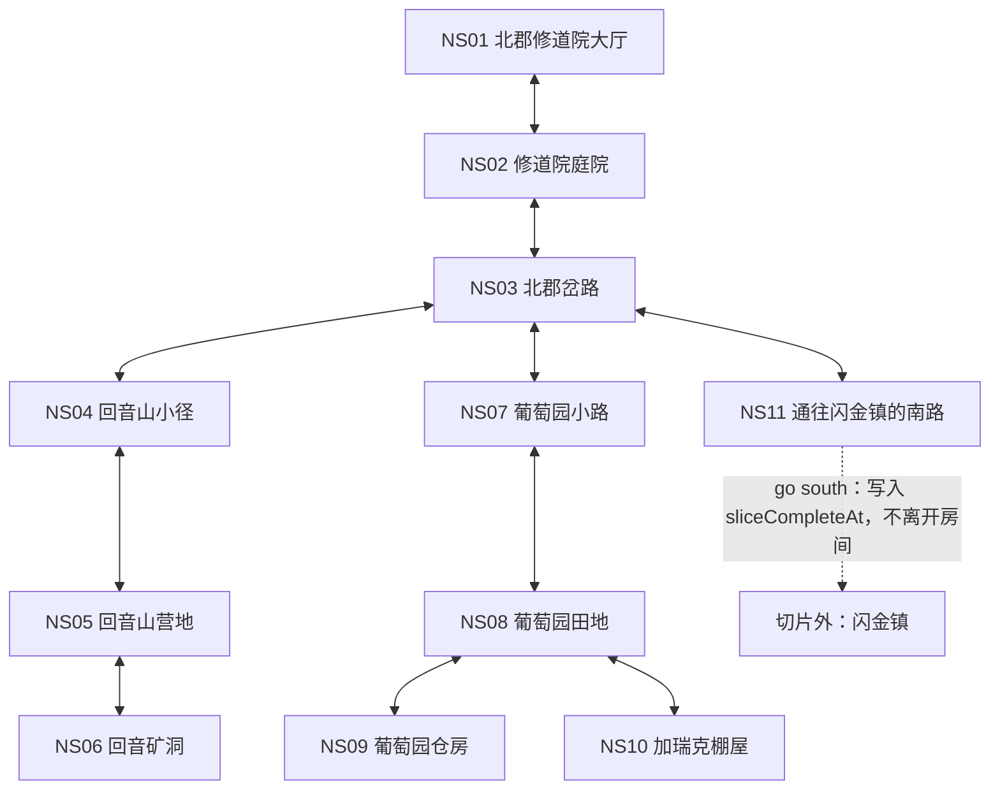

# 北郡 v1：世界与内容包

> 状态：实现基线
> 范围：北郡 1–5 级垂直切片
> 依赖：[切片契约](00-slice-contract.md)、[玩家流程](01-player-flow.md)

## 1. 内容目标

本文件冻结 11 个可实现房间，并确定 NPC、敌人、刷新、危险梯度和任务分布。房间是导航与状态广播边界，不是战斗距离单位；同一房间可以存在多个彼此独立的 `CombatSession`。

切片遵循以下约束：

- 玩家仅靠房间描述、地标、`look` 和 `exits` 可以找到所有任务目标。
- 不使用坐标、任务箭头、精确码数或隐藏出口。
- 房间的永久描述只表达所有角色都能知道的事实；任务剧透由角色知识状态控制。
- 原版地点关系保持不变，但为控制体量，将修道院内部、钟楼和训练区域合并为一个房间。
- `Report to Goldshire` 保持未交付状态；抵达南路边界只完成垂直切片，不伪造向 Marshal Dughan 交付任务。
- 房间、NPC、敌人、出生点、任务、物品、技能和个人任务对象统一遵守第 8 节来源字段契约。
- 北郡 v1 不发布顶层 `encounter` 内容记录；普通战斗由实际加入的 `SpawnInstance` 与对应 mob 模板组成，运行时 `EncounterDefinitionId = null`。脚本化敌群或 Boss 的 encounter 定义留给后续切片。
- 北郡 v1 也不发布顶层 `zone` 内容记录；11 个房间直接装载到当前唯一北郡 `WorldInstance`，`WorldInstanceId` 是运行时身份而不是内容记录。后续扩展多区域时再引入稳定 zone 内容 ID。

## 2. 房间邻接图



## 3. 房间定义

| ID | 名称 | 出口 | 关键地标与重复线索 | NPC／对象 | 敌人 | 危险 |
|---|---|---|---|---|---|---|
| `ns01_abbey_hall` | 北郡修道院大厅 | 南→NS02 | 厚重木门通向庭院；楼梯和钟声提示 Brother Neals；训练区标牌可辨认职业 | Marshal McBride、Brother Neals、Llane Beshere、Khelden Bremen | 无 | 安全 |
| `ns02_abbey_courtyard` | 修道院庭院 | 北→NS01，东→NS03 | 北侧修道院大门、补给马车、东侧主路；出生时明确提示 `look` 与 `talk deputy willem` | Deputy Willem、Brother Danil；角色出生点 | 无 | 安全 |
| `ns03_northshire_crossroads` | 北郡岔路 | 西→NS02，北→NS04，东→NS07，南→NS11 | 北方可见矿山烟尘；东方可见葡萄架；南方是边境门和大路 | 路标 | Young Wolf ×2 | 低 |
| `ns04_echo_trail` | 回音山小径 | 南→NS03，北→NS05 | 地面烛蜡和矿渣越来越多；北方能听见凿石声 | 无 | Kobold Vermin ×3 | 低 |
| `ns05_echo_camp` | 回音山营地 | 南→NS04，东→NS06 | 简陋帐篷、矿车轨道指向东侧矿洞；任务文字再次提示“更深处” | 无 | Kobold Worker ×3 | 中 |
| `ns06_echo_mine` | 回音矿洞 | 西→NS05 | 低矮矿道、密集烛火和被盗矿石；只有一个明确出口 | 无 | Kobold Laborer ×4 | 高 |
| `ns07_vineyard_lane` | 葡萄园小路 | 西→NS03，东→NS08 | 翻倒的运货车、东南方葡萄架；Milly 明确说明收成留在田地和仓房附近 | Milly Osworth | Young Wolf ×1 | 低 |
| `ns08_vineyard_fields` | 葡萄园田地 | 西→NS07，东→NS09，南→NS10 | 葡萄架、被踩坏的田垄、南侧孤立棚屋；四处个人任务采集点 | Harvest Node ×4 | Defias Thug ×3 | 中 |
| `ns09_vineyard_storehouse` | 葡萄园仓房 | 西→NS08 | 半开的仓门和四箱尚未运走的葡萄；无隐藏出口 | Harvest Node ×4 | Defias Thug ×2 | 中 |
| `ns10_garrick_shack` | 加瑞克棚屋 | 北→NS08 | 棚屋前悬着被割断的商队绳索；守卫与 Garrick 可分别辨认，返回方向始终清楚 | 无 | Garrick Padfoot ×1、Defias Thug ×1 | 高 |
| `ns11_south_road` | 通往闪金镇的南路 | 北→NS03，南→切片边界 | 边境门、南行大道和远处旅店灯火；明确说明当前版本在此结束 | `exit_ns11_south_slice_complete`（内联出口动作） | 无 | 安全 |

### 3.1 房间描述合同

每个房间的数据必须包含：

- `short_name`：状态栏和移动事件使用，最多 20 个汉字；
- `long_description`：首次进入使用，建议 80–160 个汉字；
- `repeat_description`：重复 `look` 使用，建议 40–90 个汉字；
- `landmarks[]`：至少一个可用于导航的稳定名词；
- `exits[]`：方向、目标房间、可见条件、阻挡原因；
- `occupants`：NPC、共享敌人实例和同房间玩家；
- `character_overlays[]`：只根据该角色任务和知识状态展示的补充文本。

出口必须双向校验。NS11 的南出口是唯一例外：它调用 `slice.complete`，不改变角色房间。

NS11 南出口在 `ns11_south_road.exits[]` 中使用稳定嵌套动作 ID `exit_ns11_south_slice_complete`。它是该房间记录的内联 exit action，不是独立顶层 trigger 内容记录，因此不增加第 8 节的发布记录数量；房间记录整体标为 `adapted`，并在 `adaptation_notes[]` 说明该切片边界改编。实现不得另外生成一个无 ID 的触发器或把它计作可进入房间。

## 4. NPC 定义

| ID | NPC | 房间 | 首切片职责 | 知识边界 |
|---|---|---|---|---|
| `npc_deputy_willem` | Deputy Willem | NS02 | 初始引导、迪菲亚支线、加瑞克悬赏、Milly 引导 | 未完成相关前置时不提加瑞克、葡萄收成或后续任务事实 |
| `npc_marshal_mcbride` | Marshal McBride | NS01 | 狗头人主干、`Report to Goldshire` | 按主干进度逐步揭示回音山威胁，不提前断言矿洞深处情况 |
| `npc_milly_osworth` | Milly Osworth | NS07 | 葡萄收成支线 | 仅在 `q3903_milly_osworth`、`q3904_milly_harvest` 或 `q3905_grape_manifest` 可用、进行中或待交付时提供对应任务对话；全部完成后只保留简短致谢 |
| `npc_brother_neals` | Brother Neals | NS01 | 接收 Grape Manifest | 未持有清单时只提供普通修道院寒暄 |
| `npc_llane_beshere` | Llane Beshere | NS01 | 战士训练 | 只向战士列出当前等级可学技能 |
| `npc_khelden_bremen` | Khelden Bremen | NS01 | 法师训练 | 只向法师列出当前等级可学技能 |
| `npc_brother_danil` | Brother Danil | NS02 | 基准装备出售、灰色杂物回收 | 无任务入口；v1 固定库存与价格以 04 为准 |

### 4.1 切片外 NPC 引用

| ID | 名称 | 外部位置 | v1 规则 |
|---|---|---|---|
| `npc_marshal_dughan` | Marshal Dughan | `external_goldshire` | 仅作为 #54 的未来交付对象引用；不分配房间、不生成、不显示对话，也不能在 v1 中成为交互目标 |

外部 NPC 引用只用于保持任务数据完整。内容加载器必须能解析该 ID，但不得把它计入北郡房间 NPC、导航目标或可见实体。

首切片不启用生成式 AI。所有任务、训练和错误恢复对话使用固定模板；普通寒暄也不得新增任务事实。

## 5. 敌人与刷新

| ID | 敌人 | 等级 | 出现房间 | 辨识机制 | 基础刷新 |
|---|---|---:|---|---|---:|
| `mob_young_wolf` | Young Wolf | 1–2 | NS03、NS07 | 低生命时逃离战斗并离开世界（规则见 04 §9.5）；不主动开启刷新后的战斗 | 45 秒 |
| `mob_kobold_vermin` | Kobold Vermin | 1–2 | NS04 | 普通近战 | 45 秒 |
| `mob_kobold_worker` | Kobold Worker | 2–3 | NS05 | 低生命时呼救一次，只影响当前房间 | 45 秒 |
| `mob_kobold_laborer` | Kobold Laborer | 3–4 | NS06 | 较慢但较重的公开攻击意图 | 60 秒 |
| `mob_defias_thug` | Defias Thug | 3–4 | NS08、NS09、NS10 | 可打断的绷带自疗 | 60 秒 |
| `mob_garrick_padfoot` | Garrick Padfoot | 5 | NS10 | 50% 生命时让空闲 Thug 加入本场；已在本场的 Thug 立即转火 Garrick 在触发瞬间的合法当前目标 | 90 秒 |

辨识机制列只作内容概览；触发阈值与行为参数以 [04 §7.4](./04-combat-and-progression.md) 为唯一来源。

### 5.1 固定出生点

北郡 v1 不在等级区间内随机取值。以下出生点 ID、等级和位置固定，便于经验预算、重放与可达性测试：

| 房间 | 出生点 |
|---|---|
| NS03 | `spawn_wolf_crossroads_01`（Young Wolf 1）、`spawn_wolf_crossroads_02`（Young Wolf 2） |
| NS04 | `spawn_vermin_01`（1）、`spawn_vermin_02`（1）、`spawn_vermin_03`（2） |
| NS05 | `spawn_worker_01`（2）、`spawn_worker_02`（2）、`spawn_worker_03`（3） |
| NS06 | `spawn_laborer_01`（3）、`spawn_laborer_02`（3）、`spawn_laborer_03`（4）、`spawn_laborer_04`（4） |
| NS07 | `spawn_wolf_vineyard_01`（Young Wolf 2） |
| NS08 | `spawn_thug_fields_01`（3）、`spawn_thug_fields_02`（3）、`spawn_thug_fields_03`（4） |
| NS09 | `spawn_thug_storehouse_01`（3）、`spawn_thug_storehouse_02`（4） |
| NS10 | `spawn_garrick_01`（Garrick 5）、`spawn_thug_shack_01`（Defias Thug 4） |

括号内数字为敌人等级。每个出生点同一时间最多拥有一个活动 `SpawnInstanceId`。

刷新规则：

1. 敌人是 `WorldInstance` 中的共享 `SpawnInstance`，不能被两个战斗重复占用。
2. 敌人死亡并提交奖励事务后开始刷新计时；Young Wolf 逃离成功、实例从世界移除后同样开始计时（见 04 §9.5）。仍被 CombatSession 引用时不得刷新。
3. 刷新不会因为房间内有静止玩家而自动开战。
4. 普通刷新只恢复该出生点，不复用已终结的 `RewardEpoch`。
5. Garrick 同一时间只能有一个共享实例；等待刷新时，任务文本提示玩家检查棚屋而不是制造第二个 Garrick。

## 6. 任务与对象分布

首切片最终采用 10 条任务：

| 链 | 任务 | 主要房间 |
|---|---|---|
| 狗头人主干 | `783 → 7 → 15 → 21 → 54` | NS02、NS01、NS04–NS06、NS11 |
| 迪菲亚悬赏 | `18 → 6` | NS02、NS08–NS10 |
| Milly 收成 | `3903 → 3904 → 3905` | NS02、NS07–NS09、NS01 |

`Wolves Across the Border` 及其引导任务不进入 v1，以便在 10 条任务上限内保留命名敌人、收集任务和回程交付三种验证场景。Young Wolf 仍作为非任务环境敌人存在。

### 6.1 个人任务对象

NS08 和 NS09 共放置 8 个 `Harvest Node`。它们属于角色任务覆盖层：

| 房间 | 固定节点 ID |
|---|---|
| NS08 | `harvest_fields_01`、`harvest_fields_02`、`harvest_fields_03`、`harvest_fields_04` |
| NS09 | `harvest_storehouse_01`、`harvest_storehouse_02`、`harvest_storehouse_03`、`harvest_storehouse_04` |

- 节点位置固定，不是共享世界实体，只对持有对应任务覆盖层的角色渲染；
- 两名角色可采集同一地点，不互相夺取。

采集资格、去重键、任务物品与放弃／重接语义以 [03 §4](./03-quest-state-pack.md)、[§6](./03-quest-state-pack.md) 为唯一来源。

## 7. 导航与可达性验收

内容构建阶段必须自动验证：

- 11 个房间从 NS02 全部可达；
- 除 NS11 南边界外，所有出口均存在反向出口；
- 每个任务 giver、turn-in、目标和奖励引用均存在；切片外 turn-in 必须声明为不可生成的外部引用；
- 每个任务目标从 giver 房间可达，且路径上至少每两步出现一次重复地标线索；
- 主干任务不要求通过未公开或不可见出口；
- NS06 和 NS10 的高危险在进入前一房间即可感知；
- `q054_report_goldshire` 激活后，NS01、NS02、NS03 和 NS11 均能重复提供南行线索。

## 8. 来源与改编说明

任务事实基线：

- [Elwynn Forest (Classic) quests](https://warcraft.wiki.gg/wiki/Elwynn_Forest_(Classic)_quests)
- [A Threat Within #783](https://www.wowhead.com/classic/quest=783/a-threat-within)
- [Kobold Camp Cleanup #7](https://www.wowhead.com/classic/quest=7/kobold-camp-cleanup)
- [Investigate Echo Ridge #15](https://www.wowhead.com/classic/quest=15/investigate-echo-ridge)
- [Skirmish at Echo Ridge #21](https://www.wowhead.com/classic/quest=21/skirmish-at-echo-ridge)
- [Report to Goldshire #54](https://www.wowhead.com/classic/quest=54/report-to-goldshire)
- [Brotherhood of Thieves #18](https://www.wowhead.com/classic/quest=18/brotherhood-of-thieves)
- [Bounty on Garrick Padfoot #6](https://www.wowhead.com/classic/quest=6/bounty-on-garrick-padfoot)
- [Milly Osworth #3903](https://www.wowhead.com/classic/quest=3903/milly-osworth)
- [Milly's Harvest #3904](https://www.wowhead.com/classic/quest=3904/millys-harvest)
- [Grape Manifest #3905](https://www.wowhead.com/classic/quest=3905/grape-manifest)
- [Brother Danil](https://www.wowhead.com/classic/npc=152/brother-danil)

### 8.1 通用来源字段契约

每个发布内容记录——包括房间、NPC（含外部引用）、敌人模板、固定出生点、任务、Harvest Node、普通物品、任务物品和技能——都必须包含：

```text
id, content_type, source_id, source_version, source_urls,
canonical_status, adaptation_notes, content_version
```

- `source_version` 固定为 `vanilla_1_12`，表示本包核对和改编所使用的事实基线。
- `content_version` 是整个北郡内容包的不可变发布版本，不是逐记录独立版本；同一构建的全部内容记录必须使用完全相同的值。任何会改变已发布内容记录、目标、数值或行为的修改统一提升包版本，构建必须拒绝混合 `content_version`。
- `canonical_status` 只能是 `original`、`adapted` 或 `new`。
- `original` 只用于整条记录的身份、关系、行为和数值均由来源直接支持且没有 v1 改写的情况。
- `adapted` 用于任何含有合并、删减、补充行为、调整数值或其他项目改写的记录；只要一条记录混合了原版事实与 v1 字段，整条记录就标为 `adapted`，并在 `adaptation_notes[]` 按字段说明改动及原因。
- `new` 用于原版没有直接对应物的顶层项目记录；此时 `source_id` 可为 `null`、`source_urls[]` 可为空，但 `adaptation_notes[]` 必须说明用途。NS11 的切片边界不是独立顶层记录，而是 `ns11_south_road` 的稳定内联 exit action，按第 3.1 节随房间记录校验。
- 本包顶层 `encounter` 记录数固定为 0，不得为每次普通野外战斗伪造静态 encounter 内容；运行时战斗身份由 `CombatSessionId` 表示。
- 本包顶层 `zone` 记录数固定为 0；不得把运行时 `WorldInstanceId` 伪装成内容 zone 记录。
- v1 不采用未定义的 `canonical` 值，也不以记录级 `original` 掩盖其中的改编字段。

因此，房间合并、个人任务采集节点、刷新时间、敌人辨识机制、Brother Danil 的 v1 固定库存、支线前置收束、切片南边界和全部调参数值都必须落在 `adapted` 或 `new` 记录中。任务人物关系、目标对象、主干任务顺序及区域事实可以在对应 `adaptation_notes[]` 中注明为保留的原版事实，但只要同一记录含有 v1 改编，记录整体仍为 `adapted`。
