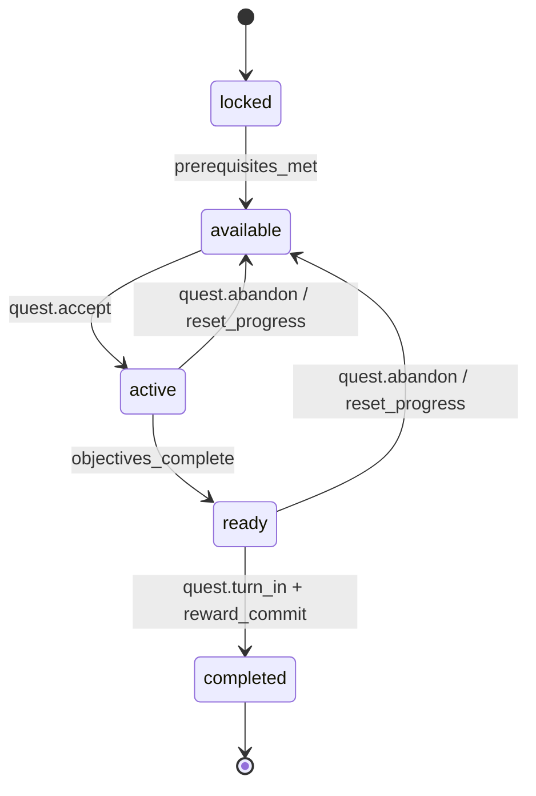
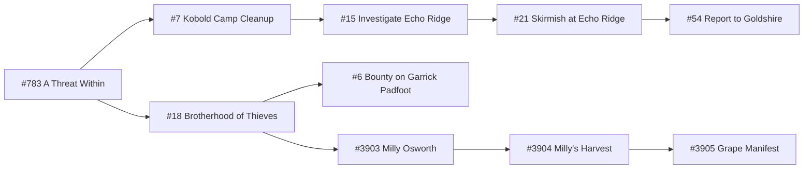

# 北郡 v1：任务与知识状态包

> 状态：实现基线
> 范围：10 条任务，其中 9 条可在切片内交付，`Report to Goldshire` 保持进行中
> 上游依赖：[切片契约](00-slice-contract.md)、[玩家流程](01-player-flow.md)、[世界与内容包](02-world-and-content.md)；下游由[战斗与成长参数](04-combat-and-progression.md)和[多人与恢复规则](06-multiplayer-and-recovery.md)消费

## 1. 通用任务状态机



状态语义：

| 状态 | 玩家可见行为 | 服务端约束 |
|---|---|---|
| `locked` | NPC 不显示该任务，也不泄露后续事实 | `quest.accept` 返回 `QUEST_LOCKED`，不改变状态 |
| `available` | NPC 提供目标、方向和奖励摘要 | 只有 giver 可接取 |
| `active` | 任务日志（`quest` 命令）显示当前目标和进度 | 只消费任务声明的结构化事件 |
| `ready` | turn-in NPC 明确提示可以交付 | 目标事件不再增加进度 |
| `completed` | 只显示简短已完成回应 | 非重复任务不能重接或再次奖励 |

任务接取与 `accept_grants` 必须在一个事务中提交；每次成功从 `available` 进入 `active` 时生成新的 `questRunId`，同一进行期内保持不变，放弃后不可复用。若接取发放物已经满足全部本地目标，同一事务可以继续把任务推进到 `ready`；本包只有 `q3905_grape_manifest` 使用该规则。任务交付、奖励、知识标记和后续解锁也必须在一个事务中提交。任一事务失败时，任务保持原状态，客户端不得显示成功。

该通用状态机完整适用于九条可在切片内交付的任务。`q054_report_goldshire` 是跨切片例外：v1 不求值其目标／交付轴，当前未放弃的进行期保持 `active`，不会进入 `ready`／`completed` 或触发 `quest.turn_in`；仍允许通用 `active → available` 放弃转换，之后可生成新 `questRunId` 重接。

## 2. 首切片任务图



## 3. 最终任务清单

所有 XP、金币和物品均为 v1 调参值，不宣称精确复刻 1.12。金币单位统一为铜币。

| 项目 ID | 原任务 | `prerequisite_quest_ids` | `giver_npc_id → turn_in_npc_id` | 目标 ID／类型 | 结构化目标参数 | 可执行目标 | v1 奖励 | 知识／解锁变化 |
|---|---|---|---|---|---|---|---|---|
| `q783_threat_within` | #783 A Threat Within | `[]` | `npc_deputy_willem → npc_marshal_mcbride` | `obj_q783_talk_mcbride` / `talk_to` | `target_npc_id=npc_marshal_mcbride`；`topic_id=topic_q783_report`；`required_count=1` | 与 Marshal McBride 交谈 | 50 XP | `met_marshal_mcbride`；解锁 `q007_kobold_cleanup`、`q018_brotherhood` |
| `q007_kobold_cleanup` | #7 Kobold Camp Cleanup | `[q783_threat_within]` | `npc_marshal_mcbride → npc_marshal_mcbride` | `obj_q007_defeat_vermin` / `defeat` | `target_mob_template_ids=[mob_kobold_vermin]`；`required_count=10` | 击败 Kobold Vermin ×10 | 250 XP、4 铜 | `kobold_vermin_reduced`；解锁 `q015_investigate_echo` |
| `q015_investigate_echo` | #15 Investigate Echo Ridge | `[q007_kobold_cleanup]` | `npc_marshal_mcbride → npc_marshal_mcbride` | `obj_q015_defeat_workers` / `defeat` | `target_mob_template_ids=[mob_kobold_worker]`；`required_count=10` | 击败 Kobold Worker ×10 | 350 XP、6 铜 | `echo_workers_confirmed`；解锁 `q021_skirmish_echo` |
| `q021_skirmish_echo` | #21 Skirmish at Echo Ridge | `[q015_investigate_echo]` | `npc_marshal_mcbride → npc_marshal_mcbride` | `obj_q021_defeat_laborers` / `defeat` | `target_mob_template_ids=[mob_kobold_laborer]`；`required_count=12` | 击败 Kobold Laborer ×12 | 550 XP、12 铜、`item_outfitter_boots` | `echo_mine_threat_confirmed`；解锁 `q054_report_goldshire` |
| `q054_report_goldshire` | #54 Report to Goldshire | `[q021_skirmish_echo]` | `npc_marshal_mcbride → npc_marshal_dughan` | `obj_q054_deliver_documents` / `deliver_item` | `target_item_id=item_mcbride_documents`；`target_npc_id=npc_marshal_dughan`；`required_count=1` | 将 Documents 交给闪金镇的 Marshal Dughan | 切片内不发任务奖励 | 接取事务授予 `assigned_to_goldshire`；抵达 NS11 南边界可写入 `sliceCompleteAt`，未放弃的任务保持 `active` |
| `q018_brotherhood` | #18 Brotherhood of Thieves | `[q783_threat_within]` | `npc_deputy_willem → npc_deputy_willem` | `obj_q018_collect_bandanas` / `collect_drop` | `target_item_id=item_red_burlap_bandana`；`source_mob_template_ids=[mob_defias_thug]`；`required_count=12` | 收集 Red Burlap Bandana ×12 | 400 XP、10 铜；战士固定获得 `item_militia_blade`，法师固定获得 `item_militia_staff` | `defias_vineyard_evidence`；解锁 `q006_garrick_bounty`、`q3903_milly_osworth` |
| `q006_garrick_bounty` | #6 Bounty on Garrick Padfoot | `[q018_brotherhood]` | `npc_deputy_willem → npc_deputy_willem` | `obj_q006_collect_garrick_head` / `collect_drop` | `target_item_id=item_garrick_head`；`source_mob_template_ids=[mob_garrick_padfoot]`；`required_count=1` | 击败 Garrick 并取得 Garrick's Head | 500 XP、16 铜；战士固定获得 `item_layered_tunic`，法师固定获得 `item_ensign_cloak` | `garrick_defeated` |
| `q3903_milly_osworth` | #3903 Milly Osworth | `[q018_brotherhood]` | `npc_deputy_willem → npc_milly_osworth` | `obj_q3903_talk_milly` / `talk_to` | `target_npc_id=npc_milly_osworth`；`topic_id=topic_q3903_intro`；`required_count=1` | 与 Milly Osworth 交谈 | 100 XP | `met_milly`；解锁 `q3904_milly_harvest` |
| `q3904_milly_harvest` | #3904 Milly's Harvest | `[q3903_milly_osworth]` | `npc_milly_osworth → npc_milly_osworth` | `obj_q3904_collect_harvest` / `collect_node` | `target_node_ids=[harvest_fields_01, harvest_fields_02, harvest_fields_03, harvest_fields_04, harvest_storehouse_01, harvest_storehouse_02, harvest_storehouse_03, harvest_storehouse_04]`；`granted_item_id=item_harvest_crate`；`required_count=8` | 从 NS08／NS09 收回 Harvest Crate ×8 | 450 XP、8 铜 | `milly_harvest_saved`；解锁 `q3905_grape_manifest` |
| `q3905_grape_manifest` | #3905 Grape Manifest | `[q3904_milly_harvest]` | `npc_milly_osworth → npc_brother_neals` | `obj_q3905_deliver_manifest` / `deliver_item` | `target_item_id=item_grape_manifest`；`target_npc_id=npc_brother_neals`；`required_count=1` | 交付 Grape Manifest | 200 XP、6 铜、`item_wine_stained_cloak` | `grape_manifest_delivered` |

九条可交付任务合计提供 2,850 XP 和 62 铜。其余 1–5 级经验来自完成任务所需的战斗；完整预算见战斗与成长参数包。

本表恰好冻结 10 个稳定 `objectiveId`。它们在整个 v1 内容集中唯一且发布后不可改名；任务数组位置、显示名称和目标类型都不能代替该 ID。以后若把一个目标拆成多个目标，必须新增 ID 并提供内容迁移，不能复用旧 ID 表示不同语义。十条任务的 `knowledge_requirements` 均固定为 `[]`、`repeatable` 均固定为 `false`；解锁仅使用表中 `prerequisite_quest_ids` 和完成事务的显式后续写入。

`topic_q783_report` 与 `topic_q3903_intro` 是嵌套在对应 objective 中的两个稳定 `topic_id`，不作为独立顶层内容记录计数。它们只能匹配本表指定 NPC；本地化主题文字不是幂等或目标身份。

表中固定任务奖励装备属于普通物品，不进入任务物品栏或 `PersonalLoot`。`quest.turn_in` 在提交前必须为每件固定普通物品预留普通背包格；空间不足时以 `QUEST_REWARD_INVENTORY_FULL` 原子拒绝整个交付，任务保持 `ready`，任务物品、XP、铜币、知识和后续解锁均不变化。重复旧 `commandId` 仍返回首次拒绝；玩家出售灰物、使用魔法水或以其他已冻结方式腾出空间后，使用新 `commandId` 重新交付。

#6 的固定目标提示必须说明棚屋有一名守卫：先击败守卫并在其刷新前挑战 Garrick 是单人基准路径；直接攻击 Garrick 可能触发守卫援助，建议两人协作。该提示是可重复查看的战术线索，不改变任务前置或目标计数。

## 4. 目标事件合同

| 目标类型 | 消费事件 | 资格与去重 |
|---|---|---|
| `talk_to` | `npc.topic_completed` | 仅目标 NPC、目标主题与任务均匹配时完成；重复交谈幂等 |
| `defeat` | `defeat_reward_committed` | 敌人 0 HP 时角色必须是合格参与者、对应 `questRunId` 处于 `active`，且提交时仍是同一进行期；每个 `(SpawnInstanceId, RewardEpoch, characterId, questRunId, objectiveId)` 最多计数一次 |
| `collect_drop` | `quest_item_committed` | 只有 0 HP 快照已冻结相同 `(questRunId, objectiveId, objectiveKind)`、且提交时仍为同一 `active` 进行期，才在敌人结算事务中直接生成任务物品并推进目标；以 `(SpawnInstanceId, RewardEpoch, characterId, questRunId, objectiveId)` 去重，不进入普通个人掉落 |
| `collect_node` | `quest_node_collected` | 仅对应 `questRunId` 处于 `active` 的角色可交互该节点；节点状态按任务进行期保存，每个 `(characterId, questRunId, nodeId)` 最多一次 |
| `deliver_item` | `quest_item_available`，随后 `quest.turn_in` | 活动任务持有所需物品时把本地目标标记完成并进入 `ready`；交付事务才消费物品、完成任务、发奖和设置知识标记。接取即发放目标物的 #3905 在接取事务内直接进入 `ready`；跨切片 #54 不在 v1 求值该目标，当前未放弃的进行期保持 `active`，仍可按通用规则放弃回到 `available` |

### 4.1 任务物品栏

Bandana、Garrick's Head、Harvest Crate、Marshal McBride's Documents 和 Grape Manifest 进入独立任务物品栏：

- 不占普通背包格；
- 不能丢弃、交易、出售或装备；
- 不能通过 `loot` 领取或通过 `decline-loot` 放弃，也没有 `pending` 个人掉落状态；
- 普通背包已满不影响任务物品生成、保存或目标推进；
- 放弃所属任务时清除；
- 重接时由来源规则重新生成或重新收集；
- 完成任务后由交付事务消费；
- 断线和重连后准确恢复。

任务物品来源固定如下：

| 物品 ID | 所属任务 | 生成时点 | 上限与失败规则 |
|---|---|---|---|
| `item_red_burlap_bandana` | #18 | Defias Thug 到达 0 HP 时已冻结对应 `questRunId/objectiveId`，且提交时同一进行期仍为 `active`，才在击败事务直接写入任务物品栏并同步推进目标 | 目标达到 12 后不再生成；该事务失败时物品与计数均不增加；0 HP 后接取不追溯生成 |
| `item_garrick_head` | #6 | Garrick 到达 0 HP 时已冻结对应 `questRunId/objectiveId`，且提交时同一进行期仍为 `active`，才在击败事务直接写入任务物品栏并同步推进目标 | 每次任务进行期最多 1；没有任务或 0 HP 后才接取时不追溯补发 |
| `item_harvest_crate` | #3904 | 角色首次成功采集对应 NS08／NS09 个人节点时生成 1 | 每个 `(characterId, questRunId, nodeId)` 最多 1，共 8；重接使用新 `questRunId` |
| `item_mcbride_documents` | #54 | `quest.accept` 的同一事务中由 Marshal McBride 发放 | 必须恰好 1；发放失败则任务仍为 `available` |
| `item_grape_manifest` | #3905 | `quest.accept` 的同一事务中由 Milly Osworth 发放 | 必须恰好 1；发放失败则任务仍为 `available` |

上述物品随所属任务放弃而删除；重接时只按本表重新生成。接取发放物不得通过重复 `quest.accept` 复制。

## 5. NPC 对话状态合同

文案必须改写，不直接复制原任务长文本。每个任务 NPC 至少提供以下状态：

| 状态 | 对话必须回答 | 禁止行为 |
|---|---|---|
| `locked` | 普通身份和当前环境事实 | 提及尚未解锁的目标、幕后关系或奖励 |
| `available` | 为什么需要帮助、目标是什么、去哪个地标、如何回来 | 只给方向名词而不说明可观察地标 |
| `active` | 当前进度、目标所在方向、下一步动作 | 用模糊语气隐藏玩家已经合法获得的目标 |
| `ready` | 明确确认目标已完成并提示交付 | 在事务提交前宣称奖励已经获得 |
| `completed` | 简短确认已发生的事实 | 再次提供非重复任务或再次发奖 |

### 5.1 角色知识覆盖层

同一房间中，不同玩家可以看到不同的 NPC 任务段落：

- 房间基础描述、共享敌人和共享战斗事件对所有可见玩家一致；
- NPC 的任务入口、提醒和结果根据每个角色自己的 quest／knowledge 状态渲染；
- 玩家 A 完成任务不会替玩家 B 解锁知识；
- `say` 中玩家自行透露的信息不写入角色知识标记，也不能让服务端跳过前置；
- 共享 Garrick 被击败只是当前共享实例状态，不代表所有房间玩家都完成悬赏。

## 6. 放弃、失败与恢复

| 场景 | 规则 |
|---|---|
| 放弃进行中任务 | 状态回到 `available`，清零目标进度并删除任务物品；知识标记不回滚已经永久获得的非剧透身份事实 |
| 放弃已可交付任务 | 与普通放弃相同；不得保留物品后重接直接交付 |
| 目标被其他玩家击败 | 未参战者不获得进度；任务目标刷新后可重试 |
| 合格参与者在击杀前死亡 | 按多人规则决定资格；合格者仍可获得任务计数，死亡本身不重置任务 |
| 采集时断线 | 已提交节点保留，未提交节点保持可采；同一 commandId 重试不重复增加 |
| 交付时数据库失败 | 状态保持 `ready`，物品与奖励均不变化，允许用原 commandId 重试 |
| 奖励提交后响应丢失 | 重试返回原成功结果，不重新发奖 |
| 角色死亡 | 任务和已提交进度保留；未冻结的动作与瞬时计算丢弃，但队友仍存活时保留的既有资格、0 HP 时已冻结的奖励及随后结算严格按 [00 §4.1](./00-slice-contract.md)／[06 §2.2](./06-multiplayer-and-recovery.md) 处理，不能笼统删除 |

首切片没有护送、限时、互斥选择和可永久失败任务。

`assigned_to_goldshire` 表示角色曾被 Marshal McBride 正式派往闪金镇，是接取后永久保留的历史知识；放弃 #54 只清除当前进行期、进度和 Documents，不撤销该标记。重接时重复授予保持幂等。

## 7. `Report to Goldshire` 与切片终点

`q054_report_goldshire` 是跨切片任务，必须区别两个事件：

1. `slice.complete`：首次触发要求 #54 处于 `active`，角色在 NS11 执行 `go south`；幂等写入 `CharacterState.sliceCompleteAt`、完成摘要和安全检查点，角色仍位于 NS11，#54 仍为 `active`，且不发任务奖励。
2. `quest.turn_in`：未来 Goldshire 内容中与 Marshal Dughan 交付文件；v1 不实现，也不得伪造。

`sliceCompleteAt` 是唯一持久完成标记，`slice_complete` 由其是否非空派生。已有该标记时，`slice.complete` 必须先于当前 #54 状态检查短路并返回原完成摘要，不更新时间，也不发 XP、金币或物品。切片完成不是删除角色，玩家仍可 `go north` 返回北郡。

完成切片后仍允许按通用规则放弃 #54：任务回到 `available`，Documents 被删除，但 `sliceCompleteAt` 不回滚。之后重接 #54 时接取事务只重建一份 Documents，任务保持 `active`；再次 `go south` 仍返回原完成结果。尚未写入 `sliceCompleteAt` 的角色则必须保持 #54 `active` 才能首次完成。

## 8. 内容 Schema 必填字段

每条任务内容必须包含：

```text
id, content_type, source_id, source_version, source_urls,
canonical_status, adaptation_notes, content_version,
title, giver_npc_id, turn_in_npc_id,
prerequisite_quest_ids, knowledge_requirements,
objectives[], accept_grants, rewards, knowledge_grants,
dialogue_by_state, abandon_policy, repeatable
```

`objectives[]` 的每个元素至少包含稳定 `id`、`objective_type` 与正整数 `required_count`，并按类型携带下表字段；本切片的精确值以第 3 节表格为准。实现不得用数组序号、显示文本或目标类型拼接值代替任何稳定 ID。

| `objective_type` | 必填目标字段 |
|---|---|
| `talk_to` | `target_npc_id`、稳定 `topic_id`；`required_count` 必须为 1 |
| `defeat` | 非空 `target_mob_template_ids[]` |
| `collect_drop` | `target_item_id`、非空 `source_mob_template_ids[]` |
| `collect_node` | 非空且无重复的 `target_node_ids[]`、`granted_item_id`；数组长度必须等于 `required_count` |
| `deliver_item` | `target_item_id`、`target_npc_id`；`required_count` 必须为 1 |

`accept_grants` 可以包含接取事务发放的任务物品和接取时知识标记；完成／交付时授予的知识只写入 `knowledge_grants`。因此 #54 的 `assigned_to_goldshire` 属于 `accept_grants`，其完成期 `knowledge_grants` 在 v1 为空。

构建时必须拒绝：

- 不存在的 NPC、房间、敌人、物品或后续任务引用；
- 缺失、重复或不在第 3 节精确集合中的 `objectiveId`／`topic_id`／类型化目标字段，以及与表中目标类型、精确目标 ID 或 `required_count` 不一致的记录；
- 非预期任务环或无法抵达的目标；
- 没有来源与改编说明的任务；
- `source_version` 不是 `vanilla_1_12`，或 `canonical_status` 不属于 `original | adapted | new`；
- 混合了原版事实和 v1 改编却标为 `original`，或 `adapted`／`new` 缺少逐项 `adaptation_notes`；
- `completed` 后仍可发奖的非重复任务；
- 对尚未拥有知识标记的角色展示后续事实。

## 9. 最低任务测试矩阵

### 9.1 九条切片内可交付任务

九条可在切片内交付的任务至少验证：

1. 前置未满足时不可接取且无剧透；
2. 满足前置后可接取；
3. 非目标事件不增加进度；
4. 目标事件准确增加一次；
5. 放弃后进度和任务物品正确重置；
6. 重接后可重新完成；接取发放物恰好重建一份；
7. 接取发放物与状态转换原子提交，重复接取不复制物品；
8. #3905 的接取发放物在同一事务使任务进入 `ready`；其他任务只在自身目标完成时进入 `ready`；
9. ready 状态交付一次，并按任务定义（含适用的职业分支）原子发放固定奖励；
10. 重复交付不产生任何收益；
11. 退出重连后状态一致；
12. 两名不同进度角色同处房间时，各自获得正确 NPC 文本和任务入口。

### 9.2 `Report to Goldshire` 专项矩阵

`q054_report_goldshire` 不执行上节第 8–9 项的本地交付测试，改为验证：

1. #21 未完成时不可接取且无剧透；完成后可接取；
2. 接取、`assigned_to_goldshire` 与一份 `item_mcbride_documents` 原子提交，任务仍为 `active`；失败、重复请求或响应丢失都不产生多份物品；
3. 到达 NS11 或执行 `go south` 不把 #54 改为 `ready`／`completed`，不执行 `quest.turn_in`，也不发任务奖励；
4. 首次完成仅在 #54 为 `active` 时写入一次 `sliceCompleteAt`，角色仍在 NS11；
5. 重复触发返回原完成摘要，首次时间和所有资产均不变化；
6. 完成前放弃会清除 Documents 并阻止首次完成，重接后只重建一份；
7. 完成前后放弃都不清除永久知识 `assigned_to_goldshire`；重接重复授予保持一个标记；
8. 完成后放弃或重接都不清除 `sliceCompleteAt`；已有标记时再次触发不依赖 #54 当前状态，仍返回原结果；
9. 退出重连后 #54、Documents、`assigned_to_goldshire`、`sliceCompleteAt` 和派生 `slice_complete` 均与服务端权威状态一致。

## 10. 来源与改编边界

任务 ID、人物关系、目标对象和链路参考：

- [项目内 Vanilla 北郡任务树](../research/vanilla-wow-human-route-reference.md#2-北郡旧版任务树)
- [Elwynn Forest (Classic) quests](https://warcraft.wiki.gg/wiki/Elwynn_Forest_(Classic)_quests)
- [Wowhead Classic quest database](https://www.wowhead.com/classic/quests/eastern-kingdoms/elwynn-forest)

XP、金币、物品属性、个人任务物品、共享进度语义、任务物品栏、支线前置收束和切片边界属于项目改编。每条任务记录按 [02 §8.1](./02-world-and-content.md) 使用 `original | adapted | new`；本包任务均含 v1 调参或流程改写，因此记录整体标记为 `adapted`，并列出 `adaptation_notes[]`。NPC 长对话只写项目改写版本，不复制来源原文。
