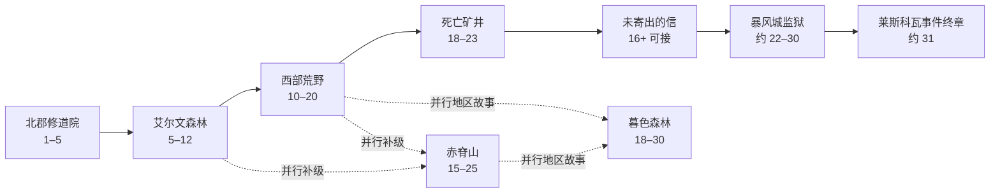

# 原始《魔兽世界》人类联盟线：文字 MUD 调研与 MVP 蓝图

> 研究日期：2026-07-15  
> 研究范围：2004–2006 年 Original WoW / Vanilla，规则与任务数据以 1.12 为主要冻结点；不混入《燃烧的远征》、大灾变重做、探索赛季、周年服新增机制或现代正式服内容。

> 战斗系统的当前有效设计见 [Vanilla WoW 文字 MUD：战斗系统设计规范](./vanilla-wow-text-mud-combat-design.md)。若本文较早的战斗交互、站位或 Boss 机制建议与该规范冲突，以战斗系统设计规范为准。

## 0. 结论先行

如果目标是做一个“保留原始《魔兽世界》气质、自己或少量朋友游玩的文字 MMORPG”，最稳妥的第一版不是此前对话里提出的“联盟 1–30、四张野外地图、两个副本”，而是：

**北郡修道院（1–5）→ 艾尔文森林（5–12）→ 西部荒野（10–20）→ 死亡矿井（18–23），以约 22 级为内容封顶。**

这条路线有四个明显优点：

1. 它拥有真正完整的原版故事闭环：地方治安恶化 → 迪菲亚活动扩大 → 调查兄弟会来源 → 进入死亡矿井击败范克里夫。
2. 地理集中在暴风城周边，房间、NPC、旅行和任务依赖量可控。
3. 死亡矿井天然提供第一个五人副本、职业分工和蓝色装备高潮。
4. 完成后仍有一条原版续线：范克里夫掉落的“未寄出的信”会把玩家带进暴风城监狱和莱斯科瓦事件，适合作为第二阶段的 22–31 级内容。

赤脊山和暮色森林应当作为并行扩展，而不是强行接成迪菲亚阴谋的后两章。原版 Vanilla 没有一条把霍格、迪菲亚、黑石兽人、狼人和上古之神全部串起来的统一主线；它的厚重感恰恰来自多个地区危机同时存在、偶尔彼此交叉。

版本上，建议采用：

- **叙事口径：**2004 年原版手册与原始任务文本。
- **规则和数据：**1.12 的职业、物品、任务与世界状态。
- **工程取舍：**只实现能支撑 1–22 级闭环的规则，不追求模拟完整 1.12 服务器。

暴雪在制作 2019 Classic 时同样选择了 1.12 作为基础，原因是它代表 Vanilla 时期最完整的数据状态；官方说明见 [Dev Watercooler: World of Warcraft Classic](https://worldofwarcraft.blizzard.com/en-us/news/21881587)。

---

## 1. 资料口径与可信度

### 1.1 “原始版”到底指什么

| 名称 | 本文用法 |
|---|---|
| Original WoW / Vanilla | 2004-11-23 商业上线至 2006 年 1.12 时期 |
| 2004 首发态 | 没有荣誉系统、战场、黑翼之巢、祖尔格拉布、安其拉和纳克萨玛斯的最初状态 |
| 1.12 完整态 | 2004–2006 内容累积后的 Vanilla 数据快照，适合作为设计母本 |
| WoW Classic | 严格说是 2019 年的官方重制版本；它以 1.12 数据为基础、分阶段开放内容 |

本文后续尽量用“Vanilla”指 2004–2006 原始时期，用“2019 Classic”指重制版，避免混淆。

### 1.2 资料优先级

| 优先级 | 资料 | 用途 | 注意事项 |
|---:|---|---|---|
| 1 | 暴雪原版游戏手册、官方开发文章 | 年代、设计意图、世界背景、系统边界 | 原版手册仍可能保留发售前信息，不能单独裁定最终数值 |
| 2 | 1.12/Classic 任务页面与游戏数据 | 任务 ID、前置关系、等级、奖励、Boss 与区域事实 | 必须确认页面标有 Classic，避开大灾变后的同名任务 |
| 3 | Warcraft Wiki 的 Classic 专页 | 任务链、区域结构、交叉索引 | 适合导航，关键事实再和任务原文交叉核对 |
| 4 | 攻略、玩家数据库和模拟器项目 | 路线、掉落、数据结构参考 | 不把玩家推测当作剧情事实，也不直接复制文本或资产 |

核心原始资料是暴雪的 [World of Warcraft Game Manual（官方 PDF）](https://bnetcmsus-a.akamaihd.net/cms/template_resource/263A8NGR8HLZ1556919642368.pdf)。其中第 149–151 页提供人类、暴风城、瓦里安失踪、年幼国王与卡特拉娜·普瑞斯托等背景；第 69 页列出人类职业；第 83–84 页说明天赋；第 112–114 页描述任务；第 63 页描述物品品质；第 133 页说明五人队伍。

### 1.3 防止资料污染的规则

在收集任务数据时，应给每条记录保存四个字段：

- `source_version`: `vanilla_1_12`
- `source_url`: 具体任务或区域页面
- `canonical_status`: `original`、`adapted` 或 `new`
- `adaptation_notes`: 为文字玩法做了哪些改动

尤其要排除以下内容：

- 大灾变后的北郡兽人入侵任务；
- 现代正式服的动态等级、自动导航、地下城查找器与个人拾取；
- 探索赛季的符文和职业改造；
- 周年服新增的便利功能；
- 后来小说、编年史或重制任务对早期剧情的再解释，除非明确标注为补充资料。

---

## 2. Vanilla 的历史背景：玩家进入的是怎样一个世界

### 2.1 开场时间点

此前对话中的“巫妖王战争结束十年”不准确。Vanilla 的开场约在海加尔山之战、联盟与部落共同击败燃烧军团后的第四年：

- 洛丹伦已经陷落，但天灾没有被消灭；
- 阿尔萨斯已前往诺森德并成为巫妖王，瘟疫之地、斯坦索姆和通灵学院仍是现实威胁；
- 联盟与部落在海加尔山的临时合作已经瓦解；
- 暴风城虽已重建，但瓦里安国王失踪，年幼的安度因戴冠；
- 王国军队被远方战事牵制，本地居民、民兵和冒险者不得不处理治安与怪物威胁；
- 玩家并非“天选救世主”，而是刚刚开始证明自己的普通冒险者。

这一时代框架可由[原版官方手册](https://bnetcmsus-a.akamaihd.net/cms/template_resource/263A8NGR8HLZ1556919642368.pdf)和原始片头文本 [Seasons of War](https://warcraft.wiki.gg/wiki/Seasons_of_War)交叉确认。

### 2.2 暴风王国的三层信息

为了保留原版探索感，设计时不要把所有真相一次性写进开场旁白。建议把知识分层：

| 层级 | 玩家何时知道 | 内容 |
|---|---|---|
| 公开事实 | 角色创建时 | 洛丹伦陷落、军队分散、瓦里安失踪、安度因年幼、地方治安恶化 |
| 地区传闻 | 1–15 级 | 迪菲亚并非普通盗匪；西部荒野民兵得不到王国充分支援 |
| 调查结论 | 15–22 级 | 范克里夫曾领导石匠工会参与重建暴风城，兄弟会与王国的劳资、政治冲突有关 |
| 深层宫廷危机 | 22–31 级 | 迪菲亚与暴风城内部腐败人物仍有联系；由“未寄出的信”和莱斯科瓦事件逐步揭示 |
| 高等级秘密 | 50–60 级 | 卡特拉娜·普瑞斯托就是奥妮克希亚，黑龙军团操纵暴风城政治；不应在低级区域提前明说 |

这让世界显得“早已存在”，而不是依赖一个全知旁白解释百科。

### 2.3 Vanilla 是多中心世界，不是单一主线

| 冲突群 | 主要内容 | Vanilla 阶段 |
|---|---|---|
| 暴风城内部危机 | 迪菲亚、死亡矿井、监狱骚乱、奥妮克希亚宫廷阴谋 | 首发即有 |
| 黑石山 | 黑铁矮人与拉格纳罗斯；黑石兽人与奈法利安 | 熔火之心首发，黑翼之巢 1.6 |
| 洛丹伦与天灾 | 瘟疫之地、血色十字军、斯坦索姆、通灵学院、纳克萨玛斯 | 基础世界，纳克萨玛斯 1.11 |
| 古拉巴什与哈卡 | 祖尔格拉布、赞达拉部族、血神哈卡 | 1.7 |
| 翡翠梦境异常 | 四条受腐化的绿龙 | 1.8 |
| 希利苏斯与安其拉 | 暮光之锤、异种虫、其拉虫人与克苏恩 | 1.8 铺垫，1.9 主体 |
| 联盟与部落冲突 | 开放世界敌对、荣誉、战场和世界 PvP | 1.4–1.12 逐步增加 |

因此，适合文字 MUD 的总结构是“地区篇章 + 少量跨区长链 + 后期交汇”，而非创造一个从 1 级操纵一切的幕后反派。

---

## 3. 对此前方案的关键纠错

| 此前说法 | 核对结果 | 应采用的版本 |
|---|---|---|
| “巫妖王战争结束十年” | 错误 | 海加尔山之战约四年后；天灾仍然活跃 |
| 暴风城周边属于“东部王国北部” | 地理错误 | 艾尔文、西部荒野、赤脊和暮色森林都在东部王国南部 |
| 艾尔文失踪农民引出黑铁矮人地下活动 | 原创剧情 | 原版艾尔文主要是狗头人、迪菲亚、河爪豺狼人、鱼人和农场纠纷 |
| 霍格背后有人支持 | 无原版依据 | 霍格只是危险的河爪豺狼人首领 |
| 击败霍格得到“霍格的断牙” | 道具错误 | 原任务交付 `Huge Gnoll Claw`；任务见 [Wanted: “Hogger”](https://www.wowhead.com/classic/quest=176/wanted-hogger) |
| 赤脊山主线是黑龙军团渗透 | 严重夸大 | 低级主线是黑石兽人、豺狼人、鱼人与湖畔镇资源危机；奥妮克希亚高等级门链后来经过此地 |
| 暮色森林揭示前面所有事件相连 | 原创统一化 | 它包含守夜人、狼人、斯塔文、摩本特·费尔、缝合怪等多条并行哥特故事 |
| “所有地区最后指向一个古老邪恶” | 不符合 Vanilla | Vanilla 有多个终局威胁，克苏恩并非 1–60 的幕后总反派 |
| 原版任务不是“杀十只狼” | 过度美化 | 原版有大量击杀和收集；厚重感来自上下文、地理、阵营与跨区任务链 |
| 1–10 艾尔文、10–20 西部荒野、20–30 赤脊/暮色严格线性 | 过度简化 | 区间重叠，原版常要求跨区补级、下副本或刷怪 |
| 战斗是固定“两秒一个回合” | 错误 | 原版是连续实时战斗；两秒跳动只适用于盗贼能量等部分机制 |
| 公会共享仓库是 Vanilla 标配 | 错误 | Vanilla 公会主要是聊天、成员与阶级；没有公会银行 |

迪菲亚“曾参与重建暴风城、之后因待遇问题反叛”的方向基本正确。原版任务 [The Defias Brotherhood（第 4 步）](https://www.wowhead.com/classic/quest=141/the-defias-brotherhood)明确把范克里夫、石匠工会和暴风城重建联系起来。

---

## 4. 人类联盟 1–31 的真实内容图

原版路线不是一条直线，而是重叠等级区间组成的网：



对文字版最重要的设计判断是：

- **故事闭环路线：**北郡 → 艾尔文 → 西部荒野 → 死亡矿井。
- **政治续线：**死亡矿井 → 未寄出的信 → 暴风城监狱 → 莱斯科瓦事件。
- **世界横向扩展：**赤脊山、暮色森林，各自拥有独立危机。

如果坚持让单个人类角色只沿这几张地图顺畅升到 30 级，就必须做一项明确改编：提高任务经验、压缩等级曲线，或增加符合原区域语境的新任务。不能一边声称“完全照原版”，一边假定原版四区本来就是严格线性且经验刚好足够。

---

## 5. 第一幕：北郡修道院（1–5）

### 5.1 叙事功能

北郡不是史诗开场，而是教学和“王国缺人”的第一份证据。玩家处理的是极小规模的问题：狗头人侵扰、盗贼、狼群、葡萄园失窃。它传达的不是“世界末日”，而是正规军无暇处理地方事务。

### 5.2 原版主干任务

必须避开大灾变后北郡的兽人入侵版本。Vanilla 人类开场主干是：

1. `A Threat Within`（783）
2. `Kobold Camp Cleanup`（7）
3. `Investigate Echo Ridge`（15）
4. `Skirmish at Echo Ridge`（21）
5. `Report to Goldshire`（54）

并行支线包括：

- `Brotherhood of Thieves`（18）
- `Milly Osworth`（3903）
- `Milly's Harvest`（3904）
- `Grape Manifest`（3905）
- `Bounty on Garrick Padfoot`（6）
- Eagan Peltskinner 的狼皮任务

可从 [Human starting experience](https://warcraft.wiki.gg/wiki/Human_starting_experience) 与 [Elwynn Forest (Classic) quests](https://warcraft.wiki.gg/wiki/Elwynn_Forest_(Classic)_quests) 交叉查看。

### 5.3 文字版房间结构

建议只做 8–12 个房间：

- 修道院庭院：出生、训练师、核心任务交接；
- 北郡道路：教学移动和方向描述；
- 回音山谷入口／矿洞深处：由安全区逐层变危险；
- 葡萄园、仓房、田埂：支线与生活感；
- 盗贼营地：第一次命名敌人；
- 通往闪金镇的南路：把新手实例感过渡为开放世界感。

成功标准不是还原每一棵树，而是让玩家不查外部攻略，也能凭“道路、山谷、矿洞、葡萄园”等地标完成任务。

---

## 6. 第二幕：艾尔文森林（5–12）

### 6.1 区域功能

艾尔文把教学扩展成一个小型社会：闪金镇、两个农场家族、伐木场、矿洞、湖泊、道路和暴风城入口。这里第一次让玩家感到：王国表面安定，基层却同时面对多种无人处理的问题。

### 6.2 主要故事簇

| 故事簇 | 内容 | 对后续的作用 |
|---|---|---|
| 法戈第矿洞／玉石矿洞 | 狗头人盘踞矿区，调查两处矿洞 | 建立探索、洞穴与资源冲突 |
| 斯通菲尔德／马科伦农场 | 两家农户的货物、项链和感情小故事 | 提供战争之外的日常生活 |
| 东谷伐木场 | 木材、工人、守卫与道路联系 | 让暴风王国具有生产结构 |
| 鱼人与湖岸 | 地方生态和旅行危险 | 丰富非人型敌人 |
| 河爪豺狼人／霍格 | 王国悬赏的地区精英 | 第一次鼓励临时组队 |
| 迪菲亚线索 | 红色亚麻、收税人／收藏者、追捕通缉犯 | 为西部荒野的组织化叛乱做铺垫 |

霍格应保持“小而有名”的地方威胁。不要给他虚构一个迪菲亚或黑龙后台；他的价值正是玩家第一次遇见仅靠单人可能打不过的精英。

### 6.3 艾尔文的叙事节奏

建议按三圈展开：

1. **闪金镇近郊：**旅店、训练师、矿洞、农场；教会任务日志与恢复节奏。
2. **森林外围：**伐木场、湖岸、鱼人和迪菲亚；教会远行与背包规划。
3. **西南边境：**河爪豺狼人和霍格；以地区悬赏收尾，并把玩家引向西部荒野。

暴风城在这一阶段只做可访问的中心：训练师、武器大师、银行、商店、邮件和政治氛围。不要一开始完整实现每个城区的所有 NPC。

---

## 7. 第三幕：西部荒野（10–20）

### 7.1 为什么它是 MVP 的核心

西部荒野把艾尔文的零散盗匪升级成社会冲突：农场衰败、流民、机械收割傀儡、民兵与迪菲亚。它让玩家看到暴风城重建繁荣的背面。

区域不是简单的“好王国对坏盗匪”：

- 王国军力不足；
- 格里安·斯托曼和人民军只能依靠本地人及冒险者；
- 迪菲亚实施抢劫、谋杀和破坏，确实是当前威胁；
- 但兄弟会的形成又与石匠工会重建暴风城后遭受的不公有关。

这种“当前行为必须制止，但历史成因值得调查”的双层结构，正是文字版最值得保留的东西。

### 7.2 区域任务层次

| 层次 | 任务体验 | 玩家得到的信息 |
|---|---|---|
| 生存层 | 清理收割傀儡、野兽、鱼人，帮助农场 | 西部荒野的经济与治安已经崩坏 |
| 民兵层 | `The People's Militia` 多阶段打击迪菲亚 | 敌人有服装、营地和分工，是组织而非随机盗匪 |
| 调查层 | 往返湖畔镇、暴风城军情七处和西部荒野 | 范克里夫、石匠工会及死亡矿井逐步浮出水面 |
| 副本层 | 护送叛徒找到入口，进入死亡矿井 | 玩家亲眼看到迪菲亚的工业与武装规模 |

区域资料可从 [Westfall Classic guide](https://www.wowhead.com/classic/guide/westfall-classic-wow) 与 [Westfall (Classic)](https://warcraft.wiki.gg/wiki/Westfall_(Classic)) 开始核对。

### 7.3 迪菲亚兄弟会七段主链

这条链应当原样保留其调查顺序，而不是开场就把范克里夫历史全部告诉玩家：

| 步骤 | ID | 行动 | 新揭示 |
|---:|---:|---|---|
| 1 | 65 | 格里安让玩家去湖畔镇找威利 | 威胁跨越西部荒野边界 |
| 2 | 132 | 把威利的便笺带回格里安 | 获得新的组织线索 |
| 3 | 135 | 把便笺送给暴风城的马迪亚斯·肖尔 | 军情七处介入 |
| 4 | 141 | 把肖尔报告交回格里安 | 范克里夫与石匠工会背景被确认 |
| 5 | 142 | 截杀迪菲亚信使 | 得到行动情报 |
| 6 | 155 | 护送迪菲亚叛徒寻找藏身处 | 找到月溪镇死亡矿井入口 |
| 7 | 166 | 进入死亡矿井，击败埃德温·范克里夫 | 西部荒野篇章完成 |

对应任务页： [65](https://www.wowhead.com/classic/quest=65/the-defias-brotherhood)、[132](https://www.wowhead.com/classic/quest=132/the-defias-brotherhood)、[135](https://www.wowhead.com/classic/quest=135/the-defias-brotherhood)、[141](https://www.wowhead.com/classic/quest=141/the-defias-brotherhood)、[142](https://www.wowhead.com/classic/quest=142/the-defias-brotherhood)、[155](https://www.wowhead.com/classic/quest=155/the-defias-brotherhood)、[166](https://www.wowhead.com/classic/quest=166/the-defias-brotherhood)。

对 MUD 而言，这条链还展示了一个重要原则：**长任务链不等于连续打怪，它应让玩家在地理、人物和知识状态上都发生位移。**

---

## 8. 第一个副本：死亡矿井（约 18–23）

### 8.1 副本定位

死亡矿井位于月溪镇矿井深处，是西部荒野剧情的实体化结局。玩家此前听说的组织、工程能力和武装力量，在副本中被转化为矿道、伐木机、铸造区、船坞和战舰。

它应当是五人内容，但个人自娱版可以提供四名规则型队友（CompanionController），或按 1–3 名真人动态缩放数值；内部仍保留坦克、治疗、输出、控制和仇恨逻辑。这里的规则型队友不是生成式 AI。

### 8.2 入场前任务包

联盟玩家可在一次副本中处理这些原版任务：

- `The Defias Brotherhood` 最终步；
- `Red Silk Bandanas`；
- `Collecting Memories`；
- `Oh Brother...`；
- `Underground Assault`；
- 范克里夫掉落物触发的 `The Unsent Letter`。

完整任务入口与等级可参考 [The Deadmines Dungeon Quests](https://www.wowhead.com/classic/guide/classic-wow-the-deadmines-dungeon-quests)。若想一次带齐，角色通常至少要达到 16 级；实际舒适攻略区间约为 18–23。

### 8.3 路线与 Boss

| 顺序 | Boss／事件 | 原版辨识点 | 适合文字化的机制 |
|---:|---|---|---|
| 1 | 拉克佐 | 矿道入口的食人魔监工 | 重击至少提前 5 秒提示；倒下后的追赶巡逻作为同一遭遇的收尾增援 |
| 可选 | 矿工约翰森 | 稀有敌人 | 用随机出现增加复刷价值 |
| 2 | 斯尼德的伐木机／斯尼德 | 载具破坏后驾驶者现身 | 明确两阶段；第一阶段可打断机械技能，第二阶段追击脆弱目标 |
| 3 | 基尔尼格 | 铸造区域 | 可打断的熔炉过载；失败后全队承受灼烧，不依赖移动 |
| 4 | 重拳先生 | 船坞门前，多次换武器 | 在约 66%／33% 生命时击昏队伍并更换战斗模式 |
| 5 | 绿皮队长 | 船上甲板 | 击退解除坦克接战并制造目标转移；与小怪组合 |
| 6 | 埃德温·范克里夫 | 迪菲亚领袖 | 开战及半血召唤护卫；台词只提示历史立场，不替玩家作道德结论 |
| 可选 | 曲奇 | 船尾鱼人厨师 | 轻松的尾声与额外掉落 |

副本结构可参考 [Deadmines strategy guide](https://www.wowhead.com/classic/guide/deadmines-dungeon-strategy-wow-classic) 与 [Deadmines (Classic)](https://warcraft.wiki.gg/wiki/Deadmines_(Classic))。

### 8.4 文字战斗输出范式

不要每 0.5 秒打印一行日志。内部可以连续调度，角色由持久战术自动行动；界面约每 5 秒生成一个决策帧，并在关键事件发生时提高优先级：

```text
[第 9 决策帧｜重拳先生 67%]
他猛击甲板，所有人失去平衡，并走向武器架。

可见意图：约 5 秒后切换双持武器（不可打断）
队伍状态：战士仇恨稳定；牧师法力 42%；盗贼的脚踢可用

默认计划：战士使用盾牌格挡；其余成员继续攻击
> shield block
[已覆盖下一合法动作：盾牌格挡]
```

玩家不输入时默认计划仍会执行；主动输入用于提高效率、节约资源或纠正危险。这样既保留读条、打断和资源管理，又符合 MUD 可暂离、低输入频率的节奏。

---

## 9. 死亡矿井之后：真正的政治续篇（约 22–31）

范克里夫会掉落 `The Unsent Letter`（373），它不是装饰性尾声，而是一条 12 步原版长链的入口：

1. `The Unsent Letter`（373）
2. `Bazil Thredd`（389）
3. `The Stockade Riots`（391）
4. `The Curious Visitor`（392）
5. `Shadow of the Past`（393）
6. `Look to an Old Friend`（350）
7. `Infiltrating the Castle`（2745）
8. `Items of Some Consequence`（2746）
9. `The Attack!`（434）
10. `The Head of the Beast`（394）
11. `Brotherhood's End`（395）
12. `An Audience with the King`（396）

任务链会经过暴风城监狱，并揭露贵族莱斯科瓦与迪菲亚袭击之间的联系，最终奖励 `Seal of Wrynn`。可从 [The Unsent Letter](https://www.wowhead.com/classic/quest=373/the-unsent-letter)、[The Attack!](https://www.wowhead.com/classic/quest=434/the-attack) 和 [Lescovar Incident quest chain](https://warcraft.wiki.gg/wiki/Lescovar_Incident_quest_chain) 核对。

这条链有两个设计意义：

- 它证明死亡矿井不是“打完坏人一切结束”；地方叛乱和宫廷问题仍有接口。
- 它被约 29 级的监狱任务卡住，天然适合作为第二阶段，而非强塞进 1–20 MVP。

如果只做一项死亡矿井后的扩展，优先做这条线和暴风城监狱，叙事连贯性高于先铺开赤脊山、暮色森林。

---

## 10. 赤脊山与暮色森林：并行世界，而非“主线第四、第五章”

### 10.1 赤脊山（约 15–25）

赤脊山的核心是孤立的湖畔镇如何在缺乏援军时抵抗多重威胁：

- 石堡的黑石兽人；
- 红脊与暗皮豺狼人；
- 湖岸鱼人和野兽；
- 物资、桥梁、工具与本地防御问题。

`Reinforcing Redridge` 相关任务让所罗门镇长分别向暴风城、西部荒野和夜色镇求援，而各地都因自己的危机无法提供足够帮助。这比虚构“所有敌人同属一个阴谋”更能表现原版世界：王国不是没有版图，而是治理能力被同时发生的危机耗尽。

可从 [Redridge Mountains (Classic)](https://warcraft.wiki.gg/wiki/Redridge_Mountains_(Classic))、[Redridge questing guide](https://warcraft.wiki.gg/wiki/Redridge_Mountains_questing_guide) 和 [Reinforcing Redridge quest chain](https://warcraft.wiki.gg/wiki/Reinforcing_Redridge_quest_chain) 查看。

黑龙线属于后来的高等级奥妮克希亚任务链，不应改写成赤脊山低级主线。

### 10.2 暮色森林（约 18–30）

暮色森林应被设计为多篇哥特短篇共享一张地图：

| 故事 | 核心体验 | 代表资料 |
|---|---|---|
| 守夜人 | 正规卫兵撤走后，夜色镇居民自保 | [The Night Watch](https://www.wowhead.com/classic/quest=56/the-night-watch) |
| 斯塔文传说 | 通过信件、地点和证词重建一桩旧案 | [The Legend of Stalvan](https://www.wowhead.com/classic/quest=66/the-legend-of-stalvan) |
| 林中的狼人 | 调查狼人来源与月神镰刀线索 | [Worgen in the Woods](https://www.wowhead.com/classic/quest=173/worgen-in-the-woods) |
| 亚伯克隆比／缝合怪 | 玩家被隐士利用，亲手促成夜色镇危机 | [The Hermit](https://www.wowhead.com/classic/quest=165/the-hermit) |
| 斯温复仇／摩本特·费尔 | 跨区寻找材料和圣化手段，最终面对死灵法师 | [Sven's Revenge](https://www.wowhead.com/classic/quest=95/svens-revenge)、[Morbent Fel](https://www.wowhead.com/classic/quest=55/morbent-fel) |
| 摩拉迪姆 | 乌鸦岭家族悲剧 | [Mor'Ladim](https://www.wowhead.com/quest=228/morladim) |

这里最适合文字媒介的是调查、误导和环境变化，而非把所有故事收束成一位总反派。完成亚伯克隆比链后，缝合怪向夜色镇移动，就是一种很强的“玩家行动改变当前世界状态”。

---

## 11. 原版系统：哪些保留，哪些简化

### 11.1 角色与职业

Vanilla 人类原本可选六职业：**战士、圣骑士、牧师、盗贼、法师、术士**。此前方案中的战法贼牧四职业是一项合理的 MVP 裁剪，但不能称为“原版人类完整职业表”。

四职业首发的优点：

- 战士承担坦克与物理前排；
- 牧师提供治疗与防护；
- 盗贼体现能量、潜行、开锁和打断；
- 法师体现法力、读条、控制和范围伤害。

圣骑士与术士应延后，但数据结构从一开始保留职业限制。不要让未来加入的矮人、侏儒或暗夜精灵在北郡出生；不同种族出生地是 Vanilla 世界感的重要组成。

### 11.2 等级、训练师和天赋

原版特征：

- 技能需要回职业训练师花钱学习，并购买更高等级；
- 10 级开始每级获得一个天赋点；
- 每个职业三棵天赋树；
- 30 级时共有 21 点，可触及 21 点层级能力；
- 武器类型受职业限制，额外类型由武器大师教授；
- 武器熟练度随实际使用上升。

文字版建议：

- 保留训练师、技能购买、三系选择与 11/21 点标志能力；
- 合并只提供极小百分比的填充天赋；
- 保留武器类型与武器大师，取消或大幅加速反复挥砍练熟练度；
- 不加入双天赋；它不是 Vanilla 基线。

### 11.3 战斗

原版并非固定两秒回合制：

- 普通攻击按武器攻速自动发生；
- 多数技能受约 1.5 秒公共冷却影响；
- 法术有瞬发、读条、引导、打断和受击退；
- 盗贼能量在早期以两秒一跳恢复；
- 战士通过造成或承受伤害获得怒气，脱战后衰减；
- 法师、牧师受法力与“五秒回蓝”节奏约束；
- 敌人有仇恨表，治疗也会产生仇恨。

文字版应保留连续事件调度，但不要求玩家按 GCD 输入。持久战术自动填充普通动作，玩家通过单个覆盖槽修改下一合法动作；界面约每 5 秒输出一个决策帧，并优先报告 Boss 意图、控制结束、目标改变和生命阈值。关键机制从公开意图到结算至少保留 5 秒；决策帧只负责汇总，不充当机械回合。

距离不采用码数、地形、战斗区域或视线，只保存“接战、接近、脱离”关系。近战技能要求接战，同一遭遇中的远程技能默认可以选择任意合法目标。完整规则见 [战斗系统设计规范](./vanilla-wow-text-mud-combat-design.md)。建议每职业首发 8–12 个关键技能。

可以删除：精确偏斜、碾压、擦过、攻击角度、抗性分段、网络延迟和旧式法术批处理。保留这些细枝末节不会明显增加“魔兽味”，却会大幅增加调试成本。

### 11.4 装备、背包与经济

应保留：

- 灰、白、绿、蓝、紫品质；1–30 以白绿为主，副本蓝装形成跃升；
- 拾取绑定、装备绑定与职业／护甲／武器限制；
- 16 格基础背包与可扩展包位的概念；
- 耐久、修理、训练、飞行和背包作为金币回收；
- 固定命名副本装备，以及少量随机后缀世界绿装。

MVP 只需灰、白、绿、蓝；紫装、套装、传说、幻化、宝石和收藏系统全部延后。

### 11.5 任务

应保留：

- 20 个任务上限；
- 按区域分组的日志；
- NPC、告示牌和物品触发；
- 对话、交付、击杀、收集、调查、护送和精英任务；
- 无现代地图箭头的文字探索。

但“无导航”不等于故意含糊。任务文本必须给出道路、方位、建筑、河流、矿洞或人物关系，`look` 命令也应能重复查看关键线索。

### 11.6 五人队与副本

应保留五人上限、手工邀请、角色亲自到副本入口、需求／贪婪与固定 Boss 蓝装。低级副本不要求现代意义的严格专精，但坦克、治疗、输出和控制已经自然形成。

私人单机模式可提供规则型队友，或让 1–3 人队动态缩放；不要因此删除仇恨、治疗和打断，否则死亡矿井会退化为血量更长的普通战斗。

### 11.7 专业技能

Vanilla 有九项主要专业，角色最多学习两项；烹饪、急救和钓鱼属于可同时学习的次要技能。

首发只建议实现：

- 采矿 → 锻造；
- 草药 → 炼金；
- 裁缝；
- 烹饪、急救。

专业熟练度上限可锁在 225。工程、附魔、钓鱼、制皮分支与稀有配方延期。

### 11.8 死亡与旅行

原版 PvE 死亡不扣经验、不掉装备；玩家以灵魂状态从墓地跑回尸体，也可接受灵魂医者的额外代价。1–30 级没有坐骑，炉石绑定旅店，飞行点需要先发现。

文字版应保留跑尸、修理费、炉石和飞行点的地理意义；把十分钟复活虚弱改为若干场战斗的减益，避免玩家只能现实等待。船、地铁和飞行可压缩成一两个旅途事件，但不能变成任意地点瞬移。

### 11.9 社交、公会、邮件和拍卖行

Vanilla 公会主要提供名称、聊天、成员、阶级和权限，**没有公会银行、等级或技能**。首发可实现：

- 说话、队伍、密语、公会频道；
- 好友与忽略；
- 直接交易、个人银行、邮件；
- 公会名称、成员和阶级。

拍卖行依赖真实人口。单人版本不宜伪造“玩家市场”，可以做 NPC 委托市场；小型多人服则等活跃人数足够后再实现。

### 11.10 总裁剪表

| 必须保留 | 适度简化 | 首发删除 |
|---|---|---|
| 等级、经验、训练师、三系天赋 | 武器熟练度追赶 | 40 人团队与锁定 |
| 四职业资源差异、读条、打断、仇恨 | 命中与抗性公式 | 自动匹配和自动传送 |
| 品质、绑定、背包、耐久、修理 | 技能等级和填充天赋 | 双天赋、符文、现代职业重做 |
| 任务链、20 格日志、地标探索 | 耐久的逐次损耗 | 公会银行、等级与技能 |
| 五人队、需求／贪婪、死亡矿井 | 复活虚弱的现实等待 | 幻化、收藏、成就、坐骑 |
| 跑尸、炉石、飞行点 | 专业与配方数量 | 复杂拍卖生态 |
| 聊天、密语、队伍和基础公会 | Boss 的精确旧脚本 | 完整 1–60 世界 |

---

## 12. 推荐 MVP：不是“缩小整个 WoW”，而是完成一个闭环

### 12.1 版本 A：垂直切片（先验证乐趣）

**范围：北郡 1–5。**

| 内容 | 设计估算 |
|---|---:|
| 房间 | 8–12 |
| 原版任务改编 | 8–10 |
| 普通敌人 | 4–6 类 |
| 命名敌人 | 1–2 |
| 职业 | 先做战士、法师各 4–5 个技能 |
| 目标 | 60–90 分钟完整通关，能验证移动、任务、战斗、掉落、升级、训练和存档 |

完成条件：玩家不看攻略能从修道院走到闪金镇；两职业节奏明显不同；退出重登后任务、背包、生命和位置准确恢复。

### 12.2 版本 B：第一个真正可玩的发行版

**范围：1–22，北郡 + 艾尔文 + 暴风城精简中心 + 西部荒野 + 死亡矿井。**

以下为工程估算，不是原版历史数据：

| 内容 | 建议范围 |
|---|---:|
| 房间 | 82–118 |
| 精选任务 | 35–45 |
| 普通敌人模板 | 25–35 |
| 命名／精英敌人 | 10–15 |
| 副本 Boss | 6 个主 Boss + 2 个可选事件 |
| 职业 | 战士、法师、盗贼、牧师 |
| 每职业技能 | 8–12 个关键技能 |
| 精选装备 | 60–90 件 |
| 专业 | 采矿/锻造、草药/炼金、裁缝、烹饪、急救的精简版 |

发行成功标准：

1. 四职业都能独立完成野外内容，组队后职责显著不同。
2. 玩家能仅凭文字地标完成至少 90% 的任务，不依赖外部地图。
3. 迪菲亚真相按任务顺序揭示，开场不会提前剧透。
4. 死亡矿井每个 Boss 至少有两个可读、可应对的机制；关键机制从公开意图到结算至少保留 5 秒，且不依赖地形或视线。
5. 单人 AI 队伍和真人五人队共用同一套仇恨、技能与副本规则。
6. 完成范克里夫后，主篇有明确结局，同时留下“未寄出的信”作为下一阶段钩子。

### 12.3 版本 C：政治续篇

**范围：22–31，暴风城监狱 + 未寄出的信／莱斯科瓦事件。**

这一阶段优先扩充暴风城内部、监狱、军情七处与宫廷 NPC，而不是同时制作两张大型野外区。它延续同一个矛盾，投入产出比最高。

### 12.4 再往后

- 想增加“战争前线”：做赤脊山。
- 想增加“文字调查和恐怖”：做暮色森林。
- 想增加第二阵营：另立项目阶段，从杜隆塔尔开始部落出生线，不要把部落角色塞进联盟地图。
- 想铺 60 级世界：按多个地区篇章扩展，不预设一条现代式主线任务。

---

## 13. 最小数据结构

### 13.1 内容实体

最低需要八类数据：

| 实体 | 必备内容 |
|---|---|
| `zone` | 名称、等级区间、天气／氛围、区域连接、音乐或文字主题 |
| `room` | 出口、可见地标、动态描述、NPC、敌人、采集点、状态变体 |
| `npc` | 身份、阵营、位置、对话主题、商店／训练／任务能力 |
| `mob` | 等级、生命、资源、技能、仇恨、掉落、刷新规则 |
| `quest` | 前置、步骤图、目标、对话、知识揭示、奖励、失败／重试 |
| `item` | 品质、绑定、装备位、属性、用途、来源 |
| `ability` | 消耗、读条、冷却、目标、威胁、效果和文本模板 |
| `encounter` | 阶段、生命阈值、意图提示、增援、失败与重置 |

### 13.2 任务应是图，不是单行清单

每个任务至少保存：

- 前置任务和互斥条件；
- 接取 NPC、交付 NPC 与步骤位置；
- 目标事件，而非只保存击杀计数；
- 完成后设置的世界状态和知识状态；
- 对其他 NPC 对话、房间描述或刷怪的影响；
- 原版事实与改编内容的来源标记。

示例（仅示意结构，文本是改写摘要，不复制官方任务原文）：

```json
{
  "id": "quest.defias.166",
  "canonical_id": 166,
  "title": "迪菲亚兄弟会：终章",
  "version": "vanilla_1_12",
  "prerequisites": ["quest.defias.155"],
  "objectives": [
    {"event": "defeat", "target": "npc.edwin_vancleef", "count": 1}
  ],
  "on_complete": {
    "set_flags": ["defias_leader_defeated"],
    "unlock_hooks": ["item.unsent_letter"]
  },
  "canonical_status": "adapted",
  "source_url": "https://www.wowhead.com/classic/quest=166/the-defias-brotherhood",
  "adaptation_notes": "目标不变；交互和战斗提示为文字版重写"
}
```

### 13.3 世界知识状态

为每个角色分别保存知识，而不是让服务器只拥有一个“剧情进度”：

```text
heard.defias_name
confirmed.defias_is_organized
confirmed.vancleef_stonemason_history
confirmed.deadmines_entrance
confirmed.lescovar_connection
```

NPC 对话根据这些标记变化。这样 AI NPC 可以改变措辞，却不会提前泄露玩家尚未调查到的真相。

---

## 14. 文字交互与 AI 的合适位置

### 14.1 命令层

建议首发命令保持小而稳定：

```text
look / exits / go
talk / ask / show
quest / journal / track
attack / cast / use / flee
status / summary / tactic / focus / assist
approach / retreat
inventory / equip / compare
party / say / whisper
map / help
```

`ask npc about defias` 比自由聊天更适合核心任务，因为它可测试、可本地化、可保证状态一致；自由聊天可以作为补充层。

### 14.2 AI NPC 的边界

AI 适合：

- 在既定事实内改写 NPC 的寒暄、抱怨和传闻；
- 记住玩家曾经帮助过谁；
- 根据天气、时间和任务进度调整语气；
- 把结构化任务目标解释成自然语言；
- 为队友生成不影响规则的战斗交流。

AI 不适合直接决定：

- 谁是幕后凶手；
- 哪个任务已经完成；
- 掉落、金币、伤害和声望；
- 原版人物之间是否新增重大关系；
- 可永久改变世界的结果。

核心规则和剧情事实必须由结构化数据裁定，AI 只负责表现层。否则长时间游玩后很容易出现 NPC 前后矛盾或把同一地区的独立故事错误串联。

---

## 15. 技术路线建议

对个人项目，优先使用成熟 MUD 框架，而不是先实现网络、账号、命令解析和持久化。可考察 [Evennia 官方文档](https://www.evennia.com/docs/latest/index.html) 与 [Evennia GitHub](https://github.com/evennia/evennia)：它已经提供账号、对象／房间、命令、持久化、Telnet 与 Web 接入等基础能力，但战斗、任务和内容模型仍需自行设计。

推荐最小分层：

```text
输入适配（Web / Telnet）
        ↓
命令与会话
        ↓
世界状态 ── 任务图 ── 战斗调度
        ↓
角色 / NPC / 物品 / 房间
        ↓
持久化数据库
```

不要在第一版引入微服务、事件总线、通用脚本语言或可热插拔规则引擎。单进程、数据库持久化、数据驱动内容足以完成 MVP。

### 15.1 建议的开发顺序

1. **北郡静态世界** → 验证房间、出口和 `look`。
2. **一条完整任务** → 验证接取、计数、交付、奖励和存档。
3. **战士／法师战斗** → 验证自动攻击、持久战术、覆盖命令、读条、资源、接战关系和死亡。
4. **训练、装备与掉落** → 验证成长循环。
5. **北郡完整垂直切片** → 做第一次真实游玩测试。
6. **艾尔文／西部荒野内容管线** → 证明新增内容主要是数据工作。
7. **五人队与规则型队友控制器** → 在死亡矿井前再实现，不要过早设计。
8. **死亡矿井** → 验证组队、仇恨、Boss 阶段和副本重置。

---

## 16. 版本时间线速查

| 日期 | 版本 | 主要内容 |
|---|---:|---|
| 2004-11-23 | 1.1.x 商业首发 | 60 级、8 种族、9 职业；熔火之心与奥妮克希亚；无荣誉和战场 |
| 2004-12-18 | 1.2 | 玛拉顿 |
| 2005-03-07 | 1.3 | 厄运之槌、集合石等 |
| 2005-04-19 | 1.4 | 第一版 PvP 荣誉与军衔 |
| 2005-06-07 | 1.5 | 战歌峡谷、奥特兰克山谷 |
| 2005-07-12 | 1.6 | 黑翼之巢、暗月马戏团 |
| 2005-09-13 | 1.7 | 祖尔格拉布、阿拉希盆地 |
| 2005-10-10 | 1.8 | 梦魇绿龙、希利苏斯扩建 |
| 2006-01-03 | 1.9 | 安其拉开门事件、两座安其拉团队副本 |
| 2006-03-28 | 1.10 | 天气、T0.5 与高等级五人本重整 |
| 2006-06-20 | 1.11 | 纳克萨玛斯、天灾入侵、钥匙链 |
| 2006-08-22 | 1.12 | 跨服战场、世界 PvP 目标、盗贼重做 |
| 2006-12-05 | 2.0.1 | TBC 前夕系统补丁，不再属于纯 1.x 规则 |
| 2007-01-16 | TBC | 外域、70 级、血精灵和德莱尼，Vanilla 时期结束 |

补丁日期与内容可从 [Warcraft Wiki patch index](https://warcraft.wiki.gg/wiki/Patch) 逐条核对；暴雪的 [Classic FAQ](https://worldofwarcraft.blizzard.com/en-us/news/23090136) 也能证明黑翼之巢、祖尔格拉布、安其拉和纳克萨玛斯并非 2004 首发即有。

---

## 17. 资料索引

### 17.1 官方与一手资料

- [World of Warcraft Game Manual（原版官方 PDF）](https://bnetcmsus-a.akamaihd.net/cms/template_resource/263A8NGR8HLZ1556919642368.pdf)
- [Dev Watercooler: World of Warcraft Classic（1.12 基线）](https://worldofwarcraft.blizzard.com/en-us/news/21881587)
- [World of Warcraft Classic FAQ（内容阶段）](https://worldofwarcraft.blizzard.com/en-us/news/23090136)
- [WoW Classic 官方入门指南](https://worldofwarcraft.blizzard.com/en-us/news/23090134)
- [Seasons of War（原始片头文本索引）](https://warcraft.wiki.gg/wiki/Seasons_of_War)

### 17.2 区域与任务

- [Elwynn Forest (Classic)](https://warcraft.wiki.gg/wiki/Elwynn_Forest_(Classic))
- [Elwynn Forest (Classic) quests](https://warcraft.wiki.gg/wiki/Elwynn_Forest_(Classic)_quests)
- [Westfall Classic guide](https://www.wowhead.com/classic/guide/westfall-classic-wow)
- [Defias Brotherhood quest chain](https://warcraft.wiki.gg/wiki/Defias_Brotherhood_quest_chain)
- [The Deadmines Dungeon Quests](https://www.wowhead.com/classic/guide/classic-wow-the-deadmines-dungeon-quests)
- [Deadmines strategy guide](https://www.wowhead.com/classic/guide/deadmines-dungeon-strategy-wow-classic)
- [Lescovar Incident quest chain](https://warcraft.wiki.gg/wiki/Lescovar_Incident_quest_chain)
- [Redridge Mountains (Classic)](https://warcraft.wiki.gg/wiki/Redridge_Mountains_(Classic))
- [Duskwood quests](https://warcraft.wiki.gg/wiki/Duskwood_quests)

### 17.3 系统

- [Quest Log](https://warcraft.wiki.gg/wiki/Quest_Log)
- [Weapon skill](https://warcraft.wiki.gg/wiki/Weapon_skill)
- [Threat](https://warcraft.wiki.gg/wiki/Threat)
- [Five-second rule](https://warcraft.wiki.gg/wiki/Five_second_rule)
- [Death](https://warcraft.wiki.gg/wiki/Death_(gameplay))
- [Flight path](https://warcraft.wiki.gg/wiki/Flight_path)
- [WoW Classic professions overview](https://www.wowhead.com/classic/guide/professions-overview-wow-classic)

---

## 18. 最终建议

把项目定义为：

> **“以 Vanilla 1.12 为资料基线、从普通人类冒险者视角重走暴风王国早期危机的文字 RPG。”**

第一版只证明三件事：

1. 原版地理和任务链在纯文字中仍然有探索感；
2. 战法贼牧与死亡矿井能形成可读、可决策的组队战斗；
3. 玩家能通过行动逐步理解迪菲亚历史，而不是阅读一篇预先写好的世界观百科。

只要北郡—艾尔文—西部荒野—死亡矿井这个闭环成立，后续无论扩展暴风城监狱、赤脊山、暮色森林还是部落出生线，都有稳定的内容生产方法。反过来，如果一开始铺开 1–30 四区、完整主城、所有职业和两个副本，很可能先得到大量资料录入工作，却迟迟无法验证“文字版魔兽到底好不好玩”。

> 版权边界提示：私人研究原型与公开发行不是同一风险等级。若未来公开发布，建议不要直接分发暴雪原文、图标、音频或完整数据资产，并在发布前单独评估知识产权与商标问题；本节不构成法律意见。
